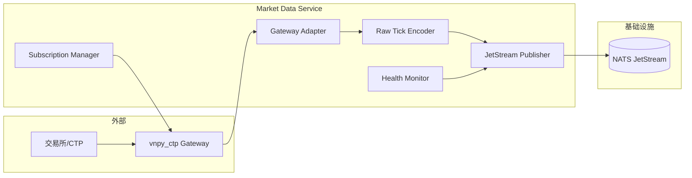
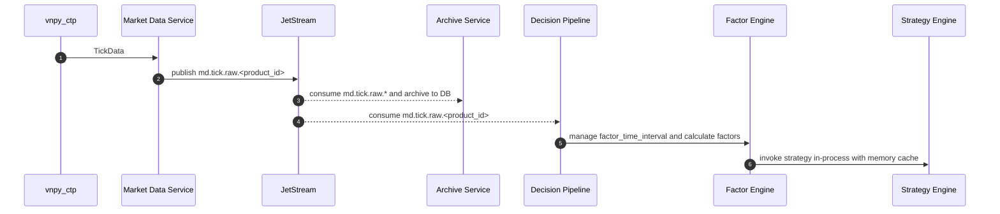

# 行情服务技术设计（Market Data Service）

## 1. 文档目标

定义 `vnpy_hft` 行情服务的最小职责技术方案：

- 基于 `vnpy_ctp` 接收实时行情
- 将原始行情按品种分片发布到 JetStream
- 保障接入稳定性、订阅管理和可观测性

本服务是“接入与分发层”，不承担数据加工与存储。

## 2. 职责边界（强约束）

### 2.1 行情服务只负责

- 连接 `vnpy_ctp`
- 订阅目标合约
- 接收 `TickData`
- 以原始口径封装事件并发布 `md.tick.raw.<product_id>`
- 提供接入状态与发布健康监控
- 在次交易日按订阅计划切换订阅合约

### 2.2 行情服务不负责

- 行情标准化
- 数据库存储（PostgreSQL）
- 文件归档（NAS）
- `factor_time_interval` 区间闭合事件生成
- 因子计算与策略判定

### 2.3 轻量化原则

- 不维护长期状态，不引入数据库依赖
- 不承载业务计算（标准化、窗口、因子、策略）
- 单机职责聚焦“接收 -> 编码 -> 发布 -> 切换订阅”

### 2.4 相关服务职责

- 归档服务：消费 `md.tick.raw.*` 并落库
- 决策流水线：按 `product_id` 消费原始行情；其中因子模块计算因子并在进程内直接调用策略模块
- 决策流水线缓存规则：原始行情缓存中未参与因子计算的数据不得淘汰
- 决策流水线切换规则：当 `contract.plan.generated.<product_id>` 生效且合约集合变化时，因子模块全量清空缓存并进入预热后再恢复决策

## 3. 与 vn.py 的对接定位

直接复用 vn.py 接入链路：

- `BaseGateway.on_tick()` 推送 `EVENT_TICK`
- `MainEngine.subscribe()` 发起订阅
- 行情服务仅监听 `EVENT_TICK` 并发布到 JetStream

说明：`OmsEngine` 只缓存最新 tick，不作为本服务输出对象，本服务只做“接收即发布”。

## 4. 服务边界

### 4.1 输入

- `vnpy_ctp` 推送的 `TickData`
- 次交易日订阅计划（用于订阅列表更新）

### 4.2 输出

- JetStream 主题：`md.tick.raw.<product_id>`
- 健康主题（可选）：`md.gateway.status`

### 4.3 依赖

- `NATS JetStream`
- `vnpy_ctp`
- 配置中心（或本地配置）

## 5. 逻辑架构



## 6. 模块设计

### 6.1 Gateway Adapter

职责：

- 初始化 `EventEngine`/`MainEngine`
- 加载 `CtpGateway`
- 建立连接、监听断线重连
- 监听 `EVENT_TICK`

### 6.2 Subscription Manager

职责：

- 管理订阅合约列表
- 支持热更新（增删订阅不重启）
- 重连后自动恢复订阅
- 支持次交易日订阅切换：按 `effective_trading_day` + `cutover_time` 原子替换订阅集合
- 默认按每个品种成交量前4主力合约构建订阅集合（可配置）

### 6.3 Raw Tick Encoder

职责：

- 将 `TickData` 原样封装为可传输消息
- 增加最小元数据（`event_id`、`received_at`、`gateway_name`）
- 基于订阅管理中的 `instrument_id -> product_id` 映射生成主题后缀
- 映射规则：`product_id` 由 `instrument_id` 去掉末尾数字得到（如 `rb2610 -> rb`、`IF2606 -> IF`）
- 按规则路由：`subject = md.tick.raw.{product_id}`

约束：

- 不做业务标准化
- 不改写行情语义字段

### 6.4 JetStream Publisher

职责：

- 发布 `md.tick.raw.<product_id>`
- 维护发送确认、失败重试与本地缓冲

语义：

- at-least-once
- 下游按 `event_id` 幂等处理
- 下游默认由 `decision-pipeline` 按 `md.tick.raw.<product_id>` 独立部署消费者实例，不同 `product_id` 不得在同一计算实例内混跑

### 6.5 Health Monitor

职责：

- 统计接收速率、发布速率、发布失败率
- 监控网关连接状态
- 输出心跳与告警

## 7. 事件模型

### 7.1 主题：`md.tick.raw.<product_id>`

```json
{
  "subject": "md.tick.raw.rb",
  "event_id": "01J...",
  "event_type": "md.tick.raw.v1",
  "product_id": "rb",
  "gateway_name": "CTP",
  "received_at": "2026-04-26T09:30:15.182+08:00",
  "tick": {
    "symbol": "rb2610",
    "exchange": "SHFE",
    "datetime": "2026-04-26T09:30:15+08:00",
    "last_price": 3512.0,
    "volume": 102345,
    "turnover": 187623450.0,
    "open_interest": 1456789,
    "bid_price_1": 3511.0,
    "bid_price_2": 3510.0,
    "bid_price_3": 3509.0,
    "bid_price_4": 3508.0,
    "bid_price_5": 3507.0,
    "ask_price_1": 3512.0,
    "ask_price_2": 3513.0,
    "ask_price_3": 3514.0,
    "ask_price_4": 3515.0,
    "ask_price_5": 3516.0,
    "bid_volume_1": 12,
    "bid_volume_2": 8,
    "bid_volume_3": 6,
    "bid_volume_4": 5,
    "bid_volume_5": 4,
    "ask_volume_1": 10,
    "ask_volume_2": 11,
    "ask_volume_3": 7,
    "ask_volume_4": 6,
    "ask_volume_5": 5,
    "localtime": "2026-04-26T09:30:15.182+08:00"
  }
}
```

## 8. 关键时序



## 9. 一致性与恢复

### 9.1 幂等

- 事件幂等键：`event_id`
- 行情服务不做去重；重复处理由下游服务幂等兜底

### 9.2 重连

- 网关断连自动重连
- 重连后自动重建订阅
- 发布失败按重试策略处理，超过阈值告警

### 9.3 重启

- 重启后恢复连接与订阅
- 本服务不依赖数据库回填，不做历史补采

### 9.4 次交易日订阅切换

- 输入：`contract.plan.generated.<product_id>`（包含 `effective_trading_day`、`cutover_time`、`product_id`、`instrument_id[]`）
- 流程：预加载次日订阅集 -> 到达切换时刻 -> 先增量订阅新集合 -> 确认后取消旧集合
- 目标：切换过程不中断服务进程，避免跨日人工重启
- 默认规则：每个 `product_id` 的订阅集合为成交量前4主力合约
- 下游协同：决策流水线同步消费对应 `contract.plan.generated.<product_id>`，若集合变化则执行全量缓存清空和预热闸门

## 10. 部署规范

### 10.1 vn.py能力边界

- `vn.py` 文档与示例表明，订阅接口支持 `Sequence[str]`，可以一次订阅多个合约。
- 官方示例同时订阅跨品种合约，如 `IF2506.CFFEX` 和 `rb2510.SHFE`。
- 因此，`vnpy` 框架本身不存在“1个行情服务实例只能订阅1个品种”的硬限制。
- 当前 `vnpy` 文档未给出“单实例最多支持多少品种/多少合约”的明确上限。
- 实际上限取决于 `vnpy_ctp/CTP前置`、网络质量、机器资源、JetStream 发布吞吐和下游消费能力。

### 10.2 默认生产部署

- 默认推荐：`1 market-collector instance -> 1 product_id -> 该品种成交量前4主力合约`
- 例如：`collector-rb` 只负责 `rb` 品种的4个主力合约，并统一发布到 `md.tick.raw.rb`
- 这种模式最符合当前主题设计、故障隔离和次交易日切换要求，推荐作为生产标准方案。

### 10.3 单品种多合约部署

- 场景：`1个品种 + 多个合约`
- 推荐：单实例独占该品种，订阅该品种的前4主力合约
- 优点：主题映射简单、切换逻辑清晰、单品种故障不影响其他品种
- 适用：生产环境默认模式

### 10.4 多品种多合约部署

- 场景：`多个品种 + 每个品种多个合约`
- `vnpy` 技术上支持单实例订阅多个品种多个合约
- 但生产上仅建议在品种数较少、流量较低、且经过压测验证后使用
- 推荐用途：开发环境、联调环境、小规模试运行
- 风险：单实例故障域变大，重连恢复时间更长，次交易日切换复杂度更高，资源争用更明显

### 10.5 扩展与分片规则

- 主题分片规则保持为 `md.tick.raw.<product_id>`
- 决策流水线必须按 `product_id` 分配独立实例订阅对应主题
- 例如 `AL` 与 `FU` 应分别启动 `decision-pipeline-AL` 与 `decision-pipeline-FU`，而不是由同一计算实例同时消费两个主题
- 行情服务扩容优先按 `product_id` 横向拆分，而不是在单实例内继续堆叠更多品种
- 若确需混合部署多个品种，应先做订阅数量、发布延迟、断线重连时长的容量测试

### 10.6 次交易日切换要求

- 默认切换单位不是“单个主力合约”，而是“某个品种的前4主力合约订阅集合”
- 切换时按 `effective_trading_day + cutover_time` 原子替换整个订阅集合
- 若单实例负责多个品种，则需对每个 `product_id` 独立维护下一交易日的目标订阅集合

## 11. 配置项

| 配置项 | 默认值/示例 | 含义 |
| --- | --- | --- |
| `gateway_name` | `CTP` | 交易网关类型 |
| `ctp_setting.*` | `brokerid/userid/...` | CTP 连接参数 |
| `publish_subject_pattern` | `md.tick.raw.{product_id}` | 原始行情发布主题模板 |
| `publish_retry_max` | `3` | 单条发布最大重试次数 |
| `publish_retry_backoff_ms` | `50` | 发布失败重试退避时间 |
| `publisher_buffer_size` | `10000` | 发布缓冲区容量 |
| `reconnect_backoff_ms` | `1000` | 网关断线重连退避时间 |
| `heartbeat_interval_sec` | `10` | 网关心跳间隔（秒） |
| `subscription_plan_source` | `db` / `topic` | 次交易日订阅计划读取来源 |
| `subscription_plan_subject_pattern` | `contract.plan.generated.{product_id}` | 订阅计划主题模板 |
| `subscription_effective_field` | `effective_trading_day` | 订阅计划生效日期字段名 |
| `subscription_cutover_field` | `cutover_time` | 订阅计划切换时间字段名 |
| `subscription_top_n_default` | `4` | 默认每品种订阅合约数 |

## 12. 可观测性与告警

### 12.1 指标

- `md_ingest_qps`
- `md_publish_qps`
- `md_publish_fail_rate`
- `md_publish_latency_ms_p95/p99`
- `md_publisher_buffer_usage`
- `md_gateway_connected`（0/1）
- `md_product_subject_cardinality`

### 12.2 告警

- `Warning`：发布失败率升高、缓冲区占用持续高位
- `Critical`：网关断连超阈值、连续无行情、消息发布不可用

## 13. 测试与验收

### 13.1 单元测试

- `TickData` 封装正确性
- 事件元数据生成（`event_id`）
- 发布失败重试逻辑

### 13.2 集成测试

- CTP 连接与订阅恢复
- JetStream 连通性与发布性能
- 下游可按 `md.tick.raw.<product_id>` 分片消费
- 次交易日按计划自动切换订阅合约

### 13.3 验收门槛

- 行情服务可用性 `>= 99.9%`
- `md.tick.raw.<product_id>` 发布成功率 `>= 99.99%`
- 断连后自动恢复订阅并继续发布
- 次交易日切换无需重启且切换后订阅集合正确

## 14. 实施计划（建议）

1. 第一阶段：接入与发布
- 完成 CTP 连接、订阅、`md.tick.raw.<product_id>` 发布

2. 第二阶段：稳定性
- 完成断连重连、发布重试、缓冲保护

3. 第三阶段：切换与联调
- 完成次交易日订阅切换机制
- 与归档服务、决策流水线完成分片订阅联调

## 15. 关联文档

- `vnpy_hft/docs/requirements/01_architecture_design.md`
- `vnpy_hft/docs/requirements/03_technical_architecture_diagram.md`
- `vnpy_hft/docs/requirements/02_database_table_design.md`
- `vnpy/vnpy/trader/gateway.py`
- `vnpy/vnpy/trader/engine.py`
- `vnpy/vnpy/trader/event.py`
- `vnpy/vnpy/trader/object.py`
