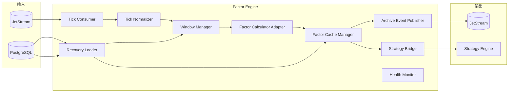
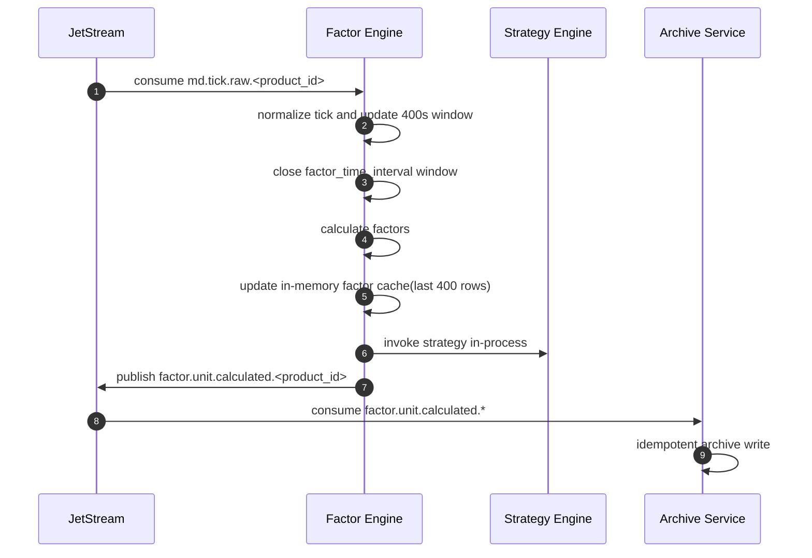

# 因子服务技术设计（Factor Engine）

## 1. 文档目标

定义 `vnpy_hft` 因子模块的可实现技术方案，覆盖：

- 消费 `md.tick.raw.<product_id>` 原始行情事件
- 维护因子侧 `factor_time_interval` 区间
- 基于最近 `400` 秒 1 秒五档行情计算实时因子
- 启动时从数据库加载最近 `400` 行因子到服务内存缓存
- 对外仅发布 `factor.unit.calculated.<product_id>` 供归档服务落库
- 通过进程内调用直接触发策略模块计算
- 使用 `MacroHFT_Features_SH/scripts/step4_preprocess_order_files_v2.py` 的离线聚合逻辑作为口径验证基准

本设计中的因子模块是 `Decision Pipeline` 的一部分，和策略模块同进程部署。

## 2. 职责边界

### 2.1 因子模块只负责

- 消费 `md.tick.raw.<product_id>`
- 将原始 tick 转换为因子计算所需的内部结构
- 维护最近 `400` 秒原始行情窗口
- 维护 `factor_time_interval` 区间闭合
- 计算因子并更新最近 `400` 行因子内存缓存
- 发布 `factor.unit.calculated.<product_id>`
- 通过内存接口直接调用策略模块

### 2.2 因子模块不负责

- 行情接入与订阅切换
- 原始行情主事实落库
- 因子结果直接写库
- 订单执行、活动委托状态机与撤单管理

### 2.3 相关模块职责

- 行情服务：发布 `md.tick.raw.<product_id>`
- 归档服务：消费 `md.tick.raw.*` 与 `factor.unit.calculated.*`，写入 PostgreSQL
- 策略模块：与因子模块同进程，接收内存回调并生成 `strategy.signal`
- 执行服务：消费 `strategy.signal` 并发单

## 3. 与 vn.py 的对接定位

`vnpy` 对本模块提供的是底层事件和对象语义参考，而不是现成的在线因子引擎：

- `vnpy.event.EventEngine` 提供事件驱动模型参考
- `vnpy.trader.object.TickData` 定义实时行情对象结构
- `vnpy` 文档明确实盘策略通常以 `TickData` 推进计算，长周期数据也是由 tick 合成

因此，因子模块在 `vnpy_hft` 中应作为在线计算模块独立实现，但复用 `vnpy` 的 tick 语义与工程组织方式。

## 4. 服务边界

### 4.1 输入

- JetStream：`md.tick.raw.<product_id>`
- 配置中心：`factor_time_interval`、`factor_set`、`factor_version`
- PostgreSQL：启动恢复时查询 `md_tick_l2_rt` 与 `factor_unit_rt`

### 4.2 输出

- JetStream：`factor.unit.calculated.<product_id>`
- In-Process：`StrategyEngine.run(context)`

### 4.3 依赖

- `NATS JetStream`
- `PostgreSQL`
- `MacroHFT_Features_SH` 中迁移后的在线因子计算模块

## 5. 逻辑架构



## 6. 模块设计

### 6.1 Tick Consumer

职责：

- 订阅 `md.tick.raw.<product_id>`
- 维护消费者偏移与幂等消费状态
- 将原始事件推入因子计算流水线

要求：

- 支持按 `product_id` 分片部署
- 同一 `product_id` 仅允许一个活跃决策流水线实例处理，避免重复计算和重复归档

### 6.2 Tick Normalizer

职责：

- 从原始消息中提取 `tick` 内容
- 转换为内部统一结构 `FactorTick`
- 补充 `vt_symbol`、`product_id`、`trading_day`、`recv_ts`

说明：

- 行情服务不做标准化，因此因子模块承担“因子计算所需的最小标准化”
- 这里只做计算口径标准化，不反向定义系统级主事实结构

### 6.3 Window Manager

职责：

- 为每个 `instrument_id` 维护最近 `400` 秒原始行情窗口
- 为每个 `instrument_id` 维护 `factor_time_interval` 区间状态
- 在时间区间闭合时产生 `FactorWindowContext`

窗口规则：

- 原始窗口长度固定 `400` 秒
- 时间区间按 `factor_time_interval` 左闭右开：`[unit_start_ts, unit_end_ts)`
- 闭合由因子模块自身触发，不依赖行情服务发送窗口事件

### 6.4 Factor Calculator Adapter

职责：

- 对接 `MacroHFT_Features_SH` 中迁移后的因子函数
- 输入最近 `factor_time_interval` 对应秒数的 1 秒五档行情切片
- 在线实现以 `step4_preprocess_order_files_v2.py` 中 `interval_to_seconds()` 与 `aggregate_by_minute()` 的聚合语义为对齐基准
- 输出 `factors_json`

要求：

- 因子实现可版本化：`factor_set` + `factor_version`
- 计算失败不得阻塞整个消费者进程，应记录错误并进入降级/重试

### 6.5 Factor Cache Manager

职责：

- 启动时从 `factor_unit_rt` 为当前 `product_id` 各活跃 `instrument_id` 加载最近 `400` 行因子
- 在每次新因子计算完成后将结果追加到进程内 RingBuffer
- 为策略模块提供只读因子快照

缓存规则：

- 缓存粒度：`instrument_id`
- 缓存容量：最近 `400` 行
- 缓存介质：仅进程内内存，不使用 Redis

### 6.6 Strategy Bridge

职责：

- 在因子结果完成后组装 `FactorDecisionContext`
- 通过进程内函数调用直接触发策略模块计算
- 传递当前因子值、最近 `400` 行因子缓存和必要窗口元数据

### 6.7 Archive Event Publisher

职责：

- 发布 `factor.unit.calculated.<product_id>`
- 将持久化责任交给归档服务

语义：

- at-least-once
- 归档服务按 `event_id` / `instrument_id + factor_time_interval + unit_end_ts + factor_set + calc_rev` 幂等处理

### 6.8 Recovery Loader

职责：

- 服务启动时回填最近窗口状态
- 从 `md_tick_l2_rt` 恢复原始行情窗口
- 从 `factor_unit_rt` 加载最近 `400` 行因子缓存

恢复目标：

- 尽可能恢复最近一个未完成或刚完成的 `factor_time_interval` 区间
- 保证策略模块启动后可以直接读取完整的最近 `400` 行因子缓存

## 7. 事件模型

### 7.1 `factor.unit.calculated.<product_id>`

```json
{
  "event_id": "01J...",
  "event_type": "factor.unit.calculated.v1",
  "subject": "factor.unit.calculated.rb",
  "product_id": "rb",
  "instrument_id": "rb2610",
  "trading_day": "2026-04-26",
  "factor_time_interval": "20s",
  "unit_start_ts": "2026-04-26T09:30:00+08:00",
  "unit_end_ts": "2026-04-26T09:30:20+08:00",
  "rev_ts": "2026-04-26T09:30:20.200+08:00",
  "factor_set": "default",
  "factor_version": "v1",
  "calc_rev": 1,
  "factors_json": {
    "spread_imbalance": 0.12,
    "mid_return": -0.0015
  }
}
```

## 8. 关键时序



## 9. 一致性与恢复

### 9.1 幂等

- 消费幂等键：`event_id`
- 因子归档幂等键：`instrument_id + factor_time_interval + unit_end_ts + factor_set + calc_rev`

### 9.2 重启恢复

- 启动时读取最近一段 `md_tick_l2_rt` 数据以重建原始窗口
- 读取最近 `factor_unit_rt` 的最近 `400` 行以恢复因子缓存和窗口游标
- 恢复期内暂不触发策略模块，直到内部状态完成对齐

### 9.3 异常处理

- 单窗口计算失败：记录错误事件，允许重试
- 连续失败：触发 `system.alert`
- 因子缓存加载不足 `400` 行：记录告警，但允许在冷启动阶段继续滚动补齐

## 10. 部署规范

### 10.1 默认部署

- 默认推荐：`1 decision-pipeline shard -> 1 product_id`
- 因子模块与策略模块同进程部署，由因子模块消费 `md.tick.raw.<product_id>`
- 与行情服务分片保持一致，便于定位和扩缩容
- 强制约束：单个决策流水线实例只允许绑定一个 `product_id`

### 10.2 单品种多合约

- 一个决策流水线实例负责同一 `product_id` 的前4主力合约
- 每个 `instrument_id` 独立维护 400 秒窗口与 `factor_time_interval` 区间
- 每个 `instrument_id` 独立维护最近 `400` 行因子缓存
- 适合作为生产环境默认模式

### 10.3 禁止多品种混部

- 本系统不允许单个决策流水线实例同时消费多个 `product_id`
- 若同时交易 `AL`、`FU`，则必须分别启动 `decision-pipeline-AL` 与 `decision-pipeline-FU`
- 这样可避免不同品种窗口、缓存、恢复状态与消费堆积互相影响

## 11. 配置项

- `factor_time_interval`
- `factor_window_seconds=400`
- `factor_cache_rows=400`
- `factor_set`
- `factor_version`
- `factor_raw_subject=md.tick.raw.{product_id}`
- `factor_archive_subject=factor.unit.calculated.{product_id}`
- `factor_calc_retry_max`
- `factor_publish_retry_max`
- `factor_publish_timeout_ms`
- `factor_recovery_lookback_seconds`
- `strategy_inproc_enabled=true`

## 12. 可观测性与告警

### 12.1 指标

- `factor_consume_qps`
- `factor_window_close_latency_ms`
- `factor_calc_latency_ms_p95/p99`
- `factor_cache_rows_loaded`
- `strategy_inproc_latency_ms_p95/p99`
- `factor_archive_publish_fail_rate`
- `factor_recovery_duration_ms`

### 12.2 告警

- `Warning`：单窗口计算延迟升高、因子缓存加载不足、归档消息发布失败率升高
- `Critical`：连续窗口计算失败、消费者中断、恢复失败

## 13. 测试与验收

### 13.1 单元测试

- `TickData -> FactorTick` 转换
- 窗口闭合边界正确性
- 因子函数输入输出一致性
- 最近 `400` 行因子缓存装载与滚动淘汰

### 13.2 集成测试

- 消费 `md.tick.raw.<product_id>` 并正确发布 `factor.unit.calculated.<product_id>`
- 归档服务对 `factor_unit_rt` 的幂等写入
- 服务重启后最近 `400` 行因子缓存恢复正确
- 因子模块完成计算后可直接触发策略模块

### 13.3 验收门槛

- `factor.unit.calculated.<product_id>` 与窗口边界严格一致
- `factor_time_interval` 闭合到因子结果发布 `p99 <= 200ms`
- 重启后最近 `400` 行因子缓存完整、无明显窗口错位与重复写入

## 14. 实施计划（建议）

1. 第一阶段：窗口骨架
- 完成原始 tick 消费、400 秒窗口与 `factor_time_interval` 闭合

2. 第二阶段：因子移植
- 接入 `MacroHFT_Features_SH` 在线因子函数、400 行因子缓存与策略内存桥接

3. 第三阶段：归档与恢复
- 接入 `factor.unit.calculated.{product_id}` 归档链路、恢复回填与告警监控

## 15. 验证基准代码

- 离线口径验证代码：[step4_preprocess_order_files_v2.py](/home/lanceliang/opt/aiwork/lance/MacroHFT_Features_SH/scripts/step4_preprocess_order_files_v2.py)
- 重点对齐函数：
- `interval_to_seconds(interval)`
- `aggregate_by_minute(df, interval=...)`
- 在线实现目标：
- 使用原始行情缓存 + 因子缓存的增量流式计算，复现离线脚本的区间聚合语义
- 建议验证方式：
- 对同一合约同一交易日原始五档数据，分别运行离线脚本与在线回放
- 比较 `factor.unit.calculated.<product_id>` 与离线聚合结果在时间边界、OHLC、五档价量、连续区间标记上的一致性

## 16. 关联文档

- `vnpy_hft/docs/requirements/01_architecture_design.md`
- `vnpy_hft/docs/requirements/02_database_table_design.md`
- `vnpy_hft/docs/requirements/03_technical_architecture_diagram.md`
- `vnpy_hft/docs/design/01_market_data_service_technical_design.md`
- `vnpy/docs/community/info/architecture.md`
- `vnpy/docs/community/app/cta_strategy.md`
- `vnpy/docs/community/app/portfolio_strategy.md`
- `vnpy/vnpy/alpha/strategy/template.py`
