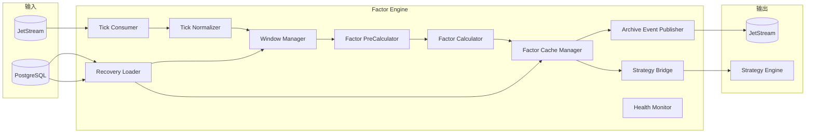
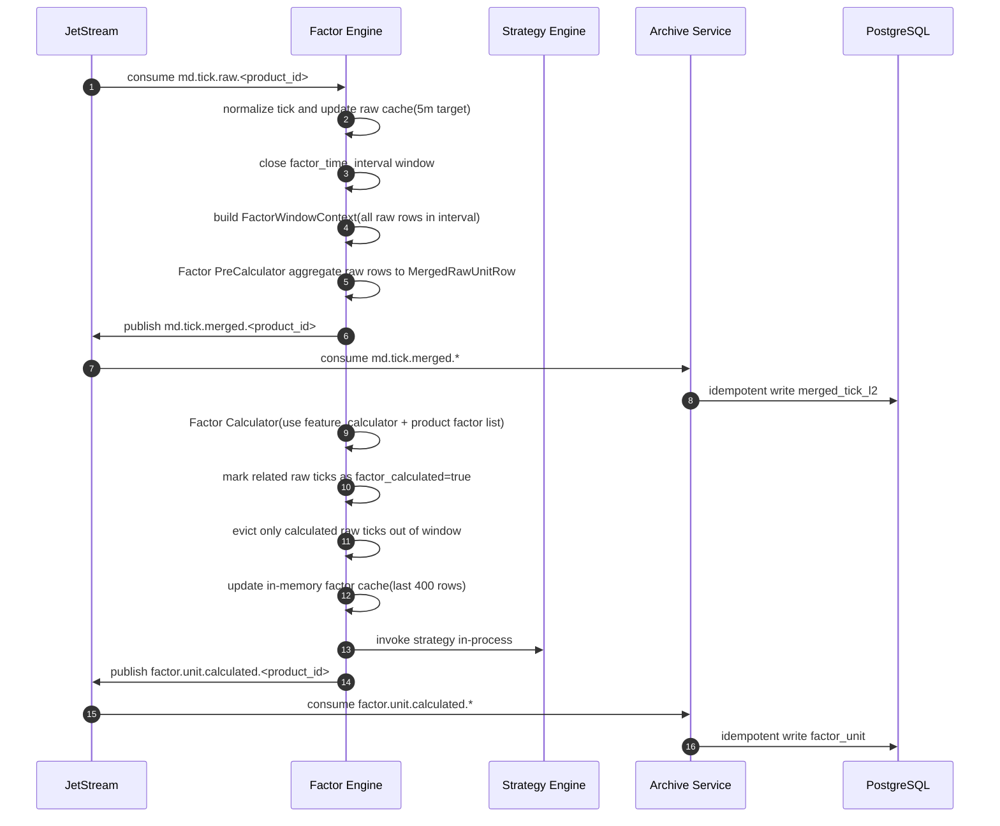

# 因子服务技术设计（Factor Engine）

## 1. 文档目标

定义 `vnpy_hft` 因子模块的可实现技术方案，覆盖：

- 消费 `md.tick.raw.<product_id>` 原始行情事件
- 维护因子侧 `factor_time_interval` 区间
- 基于最近 `5` 分钟原始行情缓存计算实时因子
- 重启启动时从数据库加载最近 `raw_market_cache_seconds` 原始行情和最近 `400` 行因子到服务内存缓存
- 非重启连续运行时通过消费 topic 流持续保留原始行情缓存与因子缓存
- 对外发布 `md.tick.merged.<product_id>`（合并后的原始行）供归档服务落库
- 对外发布 `factor.unit.calculated.<product_id>` 供归档服务落库
- 通过进程内调用直接触发策略模块计算
- 使用 `MacroHFT_Features_SH/scripts/step4_preprocess_order_files_v2.py` 的离线聚合逻辑作为口径验证基准

本设计中的因子模块是 `Decision Pipeline` 的一部分，和策略模块同进程部署。

术语说明：

- `product_id`：品种标识（如 `rb`、`al`、`IF`）
- `instrument_id`：合约标识（如 `rb2610`、`IF2606`）
- `vt_symbol`：`vnpy` 本地合约代码（`instrument_id.exchange`，如 `rb2610.SHFE`）
- 解析规则：`product_id` 由 `instrument_id` 去掉末尾数字得到（如 `rb2610 -> rb`、`IF2606 -> IF`）

## 2. 职责边界

### 2.1 因子模块只负责

- 消费 `md.tick.raw.<product_id>`
- 将原始 tick 转换为因子计算所需的内部结构
- 维护目标长度为 `5` 分钟的原始行情窗口
- 维护 `factor_time_interval` 区间闭合
- 基于“原始行情缓存 + 因子缓存”执行增量流式计算
- 计算因子并更新最近 `400` 行因子内存缓存
- 发布 `md.tick.merged.<product_id>`
- 发布 `factor.unit.calculated.<product_id>`
- 通过内存接口直接调用策略模块

### 2.2 因子模块不负责

- 行情接入与订阅切换
- 原始行情主事实落库
- 因子结果直接写库
- 订单执行、活动委托状态机与撤单管理

### 2.3 相关模块职责

- 行情服务：发布 `md.tick.raw.<product_id>`
- 归档服务：消费 `md.tick.raw.*`、`md.tick.merged.*` 与 `factor.unit.calculated.*`，写入 PostgreSQL
- 策略模块：与因子模块同进程，接收内存回调并生成 `strategy.signal`
- 执行服务：消费 `strategy.signal` 并发单

## 3. 与 vn.py 的对接定位

`vnpy` 对本模块提供的是底层事件和对象语义参考，而不是现成的在线因子引擎：

- `vnpy.event.EventEngine` 提供事件驱动模型参考
- `vnpy.trader.object.TickData` 定义实时行情对象结构
- `vnpy` 文档明确实盘策略通常以 `TickData` 推进计算，长周期数据也是由 tick 合成

因此，因子模块在 `vnpy_hft` 中应作为在线计算模块独立实现，但复用 `vnpy` 的 tick 语义与工程组织方式。

## 4. 服务边界

### 4.1 输入

- JetStream：`md.tick.raw.<product_id>`
- JetStream：`contract.plan.generated.<product_id>`（用于识别次交易日合约集合切换）
- 配置中心：`factor_time_interval`、`factor_set`、`factor_version`
- PostgreSQL：启动恢复时查询 `md_tick_l2_rt` 与 `factor_unit_rt`

### 4.2 输出

- JetStream：`md.tick.merged.<product_id>`
- JetStream：`factor.unit.calculated.<product_id>`
- In-Process：`StrategyEngine.run(context)`

### 4.3 依赖

- `NATS JetStream`
- `PostgreSQL`
- `MacroHFT_Features_SH` 中迁移后的在线因子计算模块

## 5. 逻辑架构



## 6. 模块设计

### 6.1 Tick Consumer

职责：

- 订阅 `md.tick.raw.<product_id>`
- 维护消费者偏移与幂等消费状态
- 将原始事件推入因子计算流水线

要求：

- 支持按 `product_id` 分片部署
- 同一 `product_id` 仅允许一个活跃决策流水线实例处理，避免重复计算和重复归档

### 6.2 Tick Normalizer

职责：

- 从原始消息中提取 `tick` 内容
- 转换为内部统一结构 `FactorTick`
- 补充 `vt_symbol`、`product_id`、`trading_day`、`recv_ts`

说明：

- 行情服务不做标准化，因此因子模块承担“因子计算所需的最小标准化”
- 这里只做计算口径标准化，不反向定义系统级主事实结构

### 6.3 Window Manager

职责：

- 为每个 `instrument_id` 维护最近 `5` 分钟原始行情窗口
- 为每个 `instrument_id` 维护 `factor_time_interval` 区间状态
- 为每条原始行情维护 `factor_calculated` 状态
- 在时间区间闭合时产生 `FactorWindowContext`

窗口规则：

- 原始窗口目标长度：`raw_market_cache_seconds = 300`（`5` 分钟）
- 时间分块按分钟锚点对齐：例如 `factor_time_interval=20s` 时为每分钟 `00/20/40/60` 秒闭合，`30s` 时为 `00/30/60`
- 约束：`factor_time_interval_seconds` 必须整除 `60`，确保分钟内闭合边界一致
- 时间区间按 `factor_time_interval` 左闭右开：`[unit_start_ts, unit_end_ts)`
- 闭合由因子模块自身触发，不依赖行情服务发送窗口事件
- 缓存淘汰仅允许删除“超出目标窗口且 `factor_calculated=true`”的数据
- `FactorWindowContext` 必须包含该区间内全部原始数据行（行数不固定）

### 6.4 Factor PreCalculator

职责：

- 输入 `FactorWindowContext.raw_rows_in_unit`（区间内全部原始行情行）
- 以 `MacroHFT_Features_SH/scripts/step4_preprocess_order_files_v2.py` 的 `interval_to_seconds()` 与 `aggregate_by_minute()` 为语义基准
- 将区间内多行原始行情合并为 `1` 行“合并后的原始数据”（`MergedRawUnitRow`）
- 输出仅是预聚合结果，不输出最终因子行

要求：

- 以 `window_id` 为幂等键保证同一窗口重复执行结果一致
- 对齐离线聚合口径：时间切块与闭合边界对齐 `interval_to_seconds()`，字段聚合方式对齐 `aggregate_by_minute()`（窗口内首笔/末笔/极值/末笔快照语义）
- 失败不得阻塞整个消费者进程，应记录错误并进入降级/重试

### 6.5 Factor Calculator

职责：

- 消费 `MergedRawUnitRow`，并结合历史缓存进行流式因子计算
- 对接 `MacroHFT_Features_SH/src/gen/feature_calculator.py`
- `feature_calculator` 计算完成后产出的结果才定义为“因子行”
- 根据 `product_id` 读取配置的因子列表，仅保留该品种所需因子输出

要求：

- 计算接口与口径：基准实现 `calculate_all_features(df)`，可选因子列清单基准 `get_feature_columns()`
- 启动校验：配置的因子列表必须是 `get_feature_columns()` 的子集，否则启动失败
- 因子实现可版本化：`factor_set` + `factor_version`
- 优先复用内存缓存执行增量流式计算，避免每次全量回扫
- 计算失败不得阻塞整个消费者进程，应记录错误并进入降级/重试

### 6.6 Factor Cache Manager

职责：

- 重启启动时从 `factor_unit_rt` 为当前 `product_id` 各活跃 `instrument_id` 加载最近 `400` 行因子
- 重启启动时从 `md_tick_l2_rt` 为当前 `product_id` 各活跃 `instrument_id` 加载最近 `5` 分钟原始行情
- 在每次 `Factor Calculator` 产出新因子行后将结果追加到进程内 RingBuffer
- 为策略模块提供只读因子快照

缓存规则：

- 缓存粒度：`instrument_id`
- 原始行情缓存：目标为最近 `5` 分钟（`raw_market_cache_seconds=300`）
- 缓存容量：最近 `400` 行
- 缓存介质：仅进程内内存，不使用 Redis
- 因子缓存顺序：按 `unit_end_ts` 升序维护，队尾永远是最新因子行
- 因子缓存淘汰：当行数超过 `factor_cache_rows(=400)` 时，淘汰队首最旧行
- 原始行情缓存状态：`factor_calculated`（默认 `false`，当对应区间因子计算完成后置为 `true`）
- 原始行情淘汰规则：仅当数据超出 `raw_market_cache_seconds` 且 `factor_calculated=true` 时允许淘汰
- 未计算数据保护：`factor_calculated=false` 的原始数据禁止淘汰，直到参与因子计算完成
- 说明：当未计算数据积压时，实际原始行情缓存长度允许临时超过 `raw_market_cache_seconds`
- 缓存来源：
- 重启：原始行情缓存与因子缓存均从 PostgreSQL 加载
- 非重启：原始行情缓存由 `md.tick.raw.<product_id>` 消费流持续保留，因子缓存由消费流驱动的在线计算结果持续保留
- 合约切换：当 `contract.plan.generated.<product_id>` 生效且合约集合变化时，清空该 `product_id` 下所有 `instrument_id` 的原始行情缓存、因子缓存和窗口游标
- 预热闸门：切换后暂停策略触发，直到新合约集合内每个 `instrument_id` 至少生成 `1` 行因子

### 6.7 Strategy Bridge

职责：

- 在因子结果完成后组装 `FactorDecisionContext`
- 通过进程内函数调用直接触发策略模块计算
- 传递当前因子值、最近 `400` 行因子缓存和必要窗口元数据（含 `raw_market_cache_seconds`）

### 6.8 Archive Event Publisher

职责：

- 发布 `md.tick.merged.<product_id>`
- 发布 `factor.unit.calculated.<product_id>`
- 将持久化责任交给归档服务

语义：

- at-least-once
- 归档服务按 `instrument_id + factor_time_interval + unit_end_ts + precalc_rev` 幂等处理 `md.tick.merged.*`
- 归档服务按 `event_id` / `instrument_id + factor_time_interval + unit_end_ts + factor_set + calc_rev` 幂等处理

### 6.9 Recovery Loader

职责：

- 服务启动时回填最近窗口状态
- 从 `md_tick_l2_rt` 恢复原始行情窗口（最近 `5` 分钟）
- 从 `factor_unit_rt` 加载最近 `400` 行因子缓存
- 完成两类缓存装载后才允许进入在线计算
- 在线计算后通过消费 topic 流持续滚动保留两类缓存，非重启不回库重载

恢复目标：

- 尽可能恢复最近一个未完成或刚完成的 `factor_time_interval` 区间
- 保证策略模块启动后可以直接读取完整的最近 `400` 行因子缓存

### 6.10 Contract Switch Guard

职责：

- 消费 `contract.plan.generated.<product_id>`
- 比较“当前生效合约集合”和“新生效合约集合”
- 若集合变化，执行全量缓存清空并重置窗口状态
- 在预热完成前阻断 `StrategyBridge` 调用

规则：

- 切换判定键：`product_id + effective_trading_day + cutover_time`
- 清空范围：该 `product_id` 下全部 `instrument_id` 的原始行情缓存、因子缓存、窗口游标
- 预热完成：新集合中每个 `instrument_id` 至少完成 `1` 个 `factor_time_interval` 并生成首行因子
- 说明：合约切换时执行强制全量清空，不受 `factor_calculated` 保护约束

### 6.11 FactorWindowContext 定义

`FactorWindowContext` 是由 `WindowManager` 在单个 `instrument_id` 的 `factor_time_interval` 闭合时生成的“不可变窗口快照”，用于：

- 向 `Factor PreCalculator` 提供本次预聚合输入
- 作为后续 `FactorDecisionContext` 组装的时间窗口基准

存储内容（建议字段）：

- `window_id`：窗口唯一标识，建议 `instrument_id + unit_end_ts + factor_time_interval`
- `product_id`
- `instrument_id`
- `vt_symbol`
- `trading_day`
- `factor_time_interval`
- `factor_time_interval_seconds`
- `unit_start_ts`
- `unit_end_ts`
- `aggregation_semantic`：固定 `step4.aggregate_by_minute.v2`
- `raw_market_cache_seconds_target`（固定 `300`）
- `raw_rows_in_unit`：本窗口用于计算的全部原始数据行
- `raw_rows_in_unit_count`
- `last_tick_ts`
- `raw_cache_total_rows`
- `raw_cache_uncalculated_rows`
- `raw_cache_evict_blocked_rows`
- `close_reason`：默认 `interval_closed`

说明：

- `raw_rows_in_unit` 是本次预聚合的主输入，必须覆盖 `[unit_start_ts, unit_end_ts)` 内全部原始行
- 示例：`factor_time_interval=20s` 时若区间内收到 `40` 行原始数据，则 `raw_rows_in_unit_count=40`
- `raw_cache_*` 字段用于可观测性与调试，不参与因子数学计算
- `FactorWindowContext` 本身不包含最终因子值；因子值由 `Factor Calculator` 在预聚合后计算产出
- 窗口内原始行情在完成本窗口计算后，需要将对应记录标记为 `factor_calculated=true`

示例：

```json
{
  "window_id": "rb2610-2026-04-26T09:30:20+08:00-20s",
  "product_id": "rb",
  "instrument_id": "rb2610",
  "vt_symbol": "rb2610.SHFE",
  "trading_day": "2026-04-26",
  "factor_time_interval": "20s",
  "factor_time_interval_seconds": 20,
  "unit_start_ts": "2026-04-26T09:30:00+08:00",
  "unit_end_ts": "2026-04-26T09:30:20+08:00",
  "aggregation_semantic": "step4.aggregate_by_minute.v2",
  "raw_market_cache_seconds_target": 300,
  "raw_rows_in_unit": "[...40 raw tick rows in this interval...]",
  "raw_rows_in_unit_count": 40,
  "last_tick_ts": "2026-04-26T09:30:19.900+08:00",
  "raw_cache_total_rows": 44,
  "raw_cache_uncalculated_rows": 4,
  "raw_cache_evict_blocked_rows": 4,
  "close_reason": "interval_closed"
}
```

### 6.12 MergedRawUnitRow 定义

`MergedRawUnitRow` 是 `Factor PreCalculator` 的输出，表示“该 `factor_time_interval` 区间合并后的原始数据”，是 `Factor Calculator` 的直接输入。

建议字段：

- `window_id`
- `product_id`
- `instrument_id`
- `trading_day`
- `factor_time_interval`
- `unit_start_ts`
- `unit_end_ts`
- `aggregation_semantic`
- `precalc_rev`
- `rev_ts`
- `datetime`（窗口内最后一条快照时间）
- `minute`（按 `factor_time_interval` 截断后的窗口键）
- `is_consecutive_minute`
- `open_price`
- `high_price`
- `low_price`
- `close_price`
- `total_trade_volume`
- `turnover`
- `open_interest`
- `bid1_price..bid5_price`
- `bid1_size..bid5_size`
- `ask1_price..ask5_price`
- `ask1_size..ask5_size`

## 7. 事件模型

### 7.1 `md.tick.merged.<product_id>`

```json
{
  "event_id": "01J...",
  "event_type": "md.tick.merged.v1",
  "subject": "md.tick.merged.rb",
  "product_id": "rb",
  "instrument_id": "rb2610",
  "trading_day": "2026-04-26",
  "factor_time_interval": "20s",
  "unit_start_ts": "2026-04-26T09:30:00+08:00",
  "unit_end_ts": "2026-04-26T09:30:20+08:00",
  "rev_ts": "2026-04-26T09:30:20.100+08:00",
  "aggregation_semantic": "step4.aggregate_by_minute.v2",
  "precalc_rev": 1,
  "merged_row": {
    "datetime": "2026-04-26T09:30:19.900+08:00",
    "minute": "2026-04-26T09:30:00+08:00",
    "is_consecutive_minute": 1,
    "open_price": 3568.0,
    "high_price": 3571.0,
    "low_price": 3566.0,
    "close_price": 3569.0,
    "total_trade_volume": 1200345,
    "turnover": 869034512.0,
    "open_interest": 2321456,
    "bid1_price": 3568.0,
    "bid1_size": 21,
    "ask1_price": 3569.0,
    "ask1_size": 18
  }
}
```

### 7.2 `factor.unit.calculated.<product_id>`

```json
{
  "event_id": "01J...",
  "event_type": "factor.unit.calculated.v1",
  "subject": "factor.unit.calculated.rb",
  "product_id": "rb",
  "instrument_id": "rb2610",
  "trading_day": "2026-04-26",
  "factor_time_interval": "20s",
  "unit_start_ts": "2026-04-26T09:30:00+08:00",
  "unit_end_ts": "2026-04-26T09:30:20+08:00",
  "rev_ts": "2026-04-26T09:30:20.200+08:00",
  "factor_set": "default",
  "factor_version": "v1",
  "calc_rev": 1,
  "factors_json": {
    "spread_imbalance": 0.12,
    "mid_return": -0.0015
  }
}
```

## 8. 关键时序



## 9. 一致性与恢复

### 9.1 幂等

- 消费幂等键：`event_id`
- 合并原始行归档幂等键：`instrument_id + factor_time_interval + unit_end_ts + precalc_rev`
- 因子归档幂等键：`instrument_id + factor_time_interval + unit_end_ts + factor_set + calc_rev`

### 9.2 重启恢复

- 重启场景：读取最近一段 `md_tick_l2_rt` 数据（最近 `5` 分钟）重建原始窗口
- 重启场景：读取最近 `factor_unit_rt` 的最近 `400` 行恢复因子缓存和窗口游标
- 非重启场景：不回库，继续通过已消费 topic 流滚动维护原始行情缓存与因子缓存
- 恢复期内暂不触发策略模块，直到原始行情缓存和因子缓存都完成对齐

### 9.3 合约切换恢复

- 触发条件：`contract.plan.generated.<product_id>` 到达 `effective_trading_day + cutover_time` 且合约集合变化
- 处理动作：全量清空缓存并重建窗口状态，不复用昨日合约的任何缓存
- 数据来源：从 `md.tick.raw.<product_id>` 继续流式积累，不回库装载切换时缓存
- 决策闸门：预热完成前不触发策略模块

### 9.4 异常处理

- 单窗口计算失败：记录错误事件，允许重试
- 连续失败：触发 `system.alert`
- 因子缓存加载不足 `400` 行：记录告警，但允许在冷启动阶段继续滚动补齐
- 合约切换后长时间未完成预热：触发 `system.alert` 并阻断策略
- 未计算原始行情持续堆积导致无法淘汰：触发 `system.alert` 并阻断策略

## 10. 部署规范

### 10.1 默认部署

- 默认推荐：`1 decision-pipeline shard -> 1 product_id`
- 因子模块与策略模块同进程部署，由因子模块消费 `md.tick.raw.<product_id>`
- 与行情服务分片保持一致，便于定位和扩缩容
- 强制约束：单个决策流水线实例只允许绑定一个 `product_id`

### 10.2 单品种多合约

- 一个决策流水线实例负责同一 `product_id` 的前4主力合约
- 每个 `instrument_id` 独立维护 `raw_market_cache_seconds` 窗口与 `factor_time_interval` 区间
- 每个 `instrument_id` 独立维护最近 `400` 行因子缓存
- 适合作为生产环境默认模式

### 10.3 禁止多品种混部

- 本系统不允许单个决策流水线实例同时消费多个 `product_id`
- 若同时交易 `AL`、`FU`，则必须分别启动 `decision-pipeline-AL` 与 `decision-pipeline-FU`
- 这样可避免不同品种窗口、缓存、恢复状态与消费堆积互相影响

## 11. 配置项

- `factor_time_interval`
- `raw_market_cache_minutes=5`
- `raw_market_cache_seconds=300`
- `factor_cache_rows=400`
- `factor_set`
- `factor_version`
- `factor_precalc_semantic=step4.aggregate_by_minute.v2`
- `factor_precalc_interval_parser=step4.interval_to_seconds`
- `factor_calculator_module=MacroHFT_Features_SH.src.gen.feature_calculator`
- `factor_feature_list_by_product`（按 `product_id` 配置因子列清单）
- `factor_feature_list_by_product` 示例：`{"al":["wap_balance","price_spread"],"fu":["imbalance_top3","volatility_60"]}`
- `factor_feature_list_strict=true`（配置项必须是 `get_feature_columns()` 子集）
- `factor_raw_subject=md.tick.raw.{product_id}`
- `factor_merged_subject=md.tick.merged.{product_id}`
- `factor_archive_subject=factor.unit.calculated.{product_id}`
- `contract_plan_subject=contract.plan.generated.{product_id}`
- `factor_calc_retry_max`
- `factor_publish_retry_max`
- `factor_publish_timeout_ms`
- `factor_recovery_lookback_seconds`
- `factor_switch_reset_mode=full_flush`
- `factor_warmup_min_units=1`
- `raw_cache_evict_requires_calculated=true`
- `strategy_inproc_enabled=true`

## 12. 可观测性与告警

### 12.1 指标

- `factor_consume_qps`
- `factor_window_close_latency_ms`
- `factor_calc_latency_ms_p95/p99`
- `factor_market_cache_seconds_loaded`
- `factor_cache_rows_loaded`
- `factor_market_cache_uncalculated_rows`
- `factor_market_cache_evict_blocked_rows`
- `factor_contract_switch_total`
- `factor_warmup_duration_ms`
- `strategy_inproc_latency_ms_p95/p99`
- `factor_merged_publish_fail_rate`
- `factor_archive_publish_fail_rate`
- `factor_recovery_duration_ms`

### 12.2 告警

- `Warning`：单窗口计算延迟升高、因子缓存加载不足、归档消息发布失败率升高
- `Critical`：连续窗口计算失败、消费者中断、恢复失败

## 13. 测试与验收

### 13.1 单元测试

- `TickData -> FactorTick` 转换
- 窗口闭合边界正确性
- `factor_time_interval` 分钟锚点对齐边界正确性（如 `20s -> 00/20/40/60`）
- `Factor PreCalculator` 与 `aggregate_by_minute()` 的聚合字段一致性
- `Factor Calculator` 与 `feature_calculator.calculate_all_features()` 的列值一致性
- 按 `product_id` 的因子列表裁剪正确性（仅输出配置列）
- 启动时因子列表配置校验正确性（非法列触发 fail-fast）
- 原始行情缓存 `5` 分钟目标与超窗保护边界正确性
- 原始行情 `factor_calculated` 状态流转与淘汰条件正确性
- 未计算原始行情不得被淘汰
- 最近 `400` 行因子缓存装载与滚动淘汰
- 合约集合切换时全量缓存清空与窗口游标重置正确性

### 13.2 集成测试

- 消费 `md.tick.raw.<product_id>` 并正确发布 `factor.unit.calculated.<product_id>`
- 消费 `md.tick.raw.<product_id>` 并正确发布 `md.tick.merged.<product_id>`
- `FactorWindowContext -> MergedRawUnitRow` 在线预聚合结果与离线脚本一致
- `MergedRawUnitRow -> factor row` 在线计算结果与 `feature_calculator` 一致
- 启动时同时恢复原始行情缓存与因子缓存
- 非重启连续运行时缓存来自消费 topic 流且不中断
- 原始行情缓存仅淘汰 `factor_calculated=true` 且超窗数据
- 合约集合切换后全量清缓存并进入预热
- 归档服务对 `merged_tick_l2_rt` 的幂等写入
- 归档服务对 `factor_unit_rt` 的幂等写入
- 服务重启后最近 `400` 行因子缓存恢复正确
- 因子模块完成计算后可直接触发策略模块

### 13.3 验收门槛

- `factor.unit.calculated.<product_id>` 与窗口边界严格一致
- `md.tick.merged.<product_id>` 与窗口边界严格一致
- `factor_time_interval` 闭合到因子结果发布 `p99 <= 200ms`
- 合并后原始数据（`MergedRawUnitRow`）字段口径与 `aggregate_by_minute()` 一致
- 因子列口径与 `feature_calculator` 一致，且仅包含该 `product_id` 配置的因子列表
- 重启后最近 `5` 分钟原始行情缓存与最近 `400` 行因子缓存完整、无明显窗口错位与重复写入
- 合约切换后仅当预热完成才恢复策略触发，且不出现跨合约缓存污染

## 14. 实施计划（建议）

1. 第一阶段：窗口骨架
- 完成原始 tick 消费、`5` 分钟原始窗口与 `factor_time_interval` 闭合

2. 第二阶段：PreCalculator 落地
- 基于 `interval_to_seconds()` + `aggregate_by_minute()` 完成在线预聚合（输出 `MergedRawUnitRow`）

3. 第三阶段：Factor Calculator 落地
- 接入 `feature_calculator`，按 `product_id` 因子列表输出因子行，并打通 400 行缓存与策略内存桥接

4. 第四阶段：归档与恢复
- 接入 `md.tick.merged.{product_id}` 与 `factor.unit.calculated.{product_id}` 归档链路、恢复回填与告警监控

## 15. 验证基准代码

- 离线口径验证代码：[step4_preprocess_order_files_v2.py](/home/lanceliang/opt/aiwork/lance/MacroHFT_Features_SH/scripts/step4_preprocess_order_files_v2.py)
- 因子计算基准代码：[feature_calculator.py](/home/lanceliang/opt/aiwork/lance/MacroHFT_Features_SH/src/gen/feature_calculator.py)
- 重点对齐函数：
- `interval_to_seconds(interval)`
- `aggregate_by_minute(df, interval=...)`
- `calculate_all_features(df)`
- `get_feature_columns()`
- 在线实现目标：
- 使用原始行情缓存 + 因子缓存的增量流式计算，先输出 `MergedRawUnitRow`，再计算最终因子行
- 运行时先发布 `md.tick.merged.<product_id>` 供归档服务落库，再发布 `factor.unit.calculated.<product_id>`
- 建议验证方式：
- 对同一合约同一交易日原始五档数据，分别运行离线脚本与在线回放
- 对比 PreCalculator 输出与离线 `aggregate_by_minute()` 在时间边界、OHLC、五档价量、连续区间标记上的一致性
- 对比 Factor Calculator 输出与 `calculate_all_features()` + 因子列裁剪后的一致性

## 16. 关联文档

- `vnpy_hft/docs/requirements/01_architecture_design.md`
- `vnpy_hft/docs/requirements/02_database_table_design.md`
- `vnpy_hft/docs/requirements/03_technical_architecture_diagram.md`
- `vnpy_hft/docs/design/01_market_data_service_technical_design.md`
- `vnpy/docs/community/info/architecture.md`
- `vnpy/docs/community/app/cta_strategy.md`
- `vnpy/docs/community/app/portfolio_strategy.md`
- `vnpy/vnpy/alpha/strategy/template.py`
