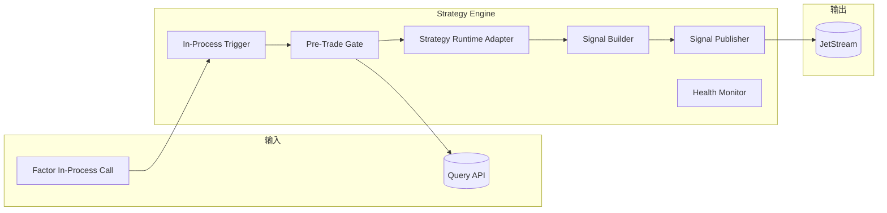
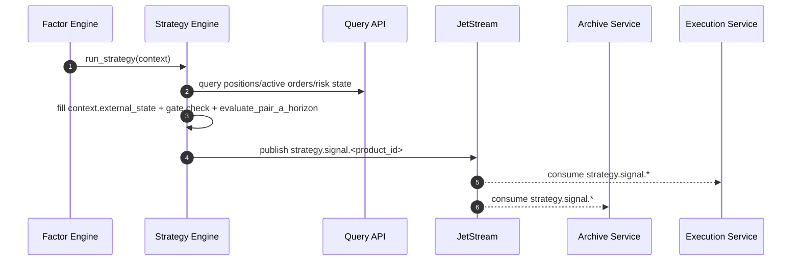

# 决策服务技术设计（Strategy Engine）

## 1. 文档目标

定义 `vnpy_hft` 策略模块的可实现技术方案，覆盖：

- 通过进程内接口接收因子模块回调
- 消费由因子模块组装的 `FactorDecisionContext`（仅包含 horizon 级输入与外部状态）
- 接入 `ArchetypeTrader` 决策逻辑
- 执行前置闸门校验并输出交易信号
- 支撑按 `product_id` 的同进程部署、状态恢复与信号时效控制
- 策略触发由因子模块按 `factor_time_interval` 逐步累积 `horizon_states`，凑满一个 horizon 后调用 `evaluate_pair_a_horizon`

本设计中的策略模块是 `Decision Pipeline` 的一部分，和因子模块同进程部署。

术语说明：

- `product_id`：品种标识（如 `rb`、`al`、`IF`）
- `instrument_id`：合约标识（如 `rb2610`、`IF2606`）
- `vt_symbol`：`vnpy` 本地合约代码（`instrument_id.exchange`）
- 解析规则：`product_id` 由 `instrument_id` 去掉末尾数字得到（如 `rb2610 -> rb`、`IF2606 -> IF`）

## 2. 职责边界

### 2.1 策略模块只负责

- 接收因子模块的进程内回调
- 管理策略运行上下文：持仓、活动委托状态、行情新鲜度、风控放行状态
- 读取并校验 `FactorDecisionContext` 的完整性（horizon 状态序列 + 外部状态）
- 在满足闸门条件时运行策略逻辑
- 发布 `strategy.signal.<product_id>`

### 2.2 策略模块不负责

- 行情订阅与原始行情主事实落库
- 因子计算本身
- 因子归档写库
- 最终下单、撤单、成交处理
- 委托状态生命周期管理

### 2.3 相关模块职责

- 因子模块：计算因子并累积 `horizon_states`，凑满后组装 `FactorDecisionContext` 并通过内存调用策略模块
- 归档服务：消费 `strategy.signal.*` 做信号归档，并消费 `factor.unit.calculated.*` 写入 `factor_unit_*`
- 执行服务：消费 `strategy.signal.*` 并发单
- 风控服务：给出事前风控结论
- `vnpy` 执行底座：通过 `OmsEngine` 提供持仓、活动委托、成交等实时状态语义参考

## 3. 与 vn.py 的对接定位

`vnpy` 为策略模块提供的重要参考有三类：

- `EventEngine` 的事件驱动调度模型
- `OmsEngine` 的实时态缓存模型：活动委托、持仓、账户
- 策略模板中的目标状态管理思路

参考依据：

- `vnpy` 文档说明实盘策略主要从 `TickData` 推进计算，长周期数据仍由 tick 合成
- `portfolio_strategy` 文档展示了多合约策略在同一运行时中组织决策的思路
- `vnpy.alpha.strategy.template.AlphaStrategy` 展示了“当前仓位 + 目标仓位 + 执行调整”的抽象模式

因此，策略模块应吸收 `vnpy` 的状态管理方式，但在物理部署上与因子模块同进程运行，不直接依赖因子消息通道或 PostgreSQL 因子表。

## 4. 服务边界

### 4.1 输入

- In-Process：`FactorEngine.run_strategy(context)`
- 同步查询接口：当前持仓、活动委托、风控参数、最新账户状态（用于补齐 `FactorDecisionContext.external_state`）

### 4.2 输出

- JetStream：`strategy.signal.<product_id>`

### 4.3 依赖

- `NATS JetStream`
- `OMS/Query API`
- `ArchetypeTrader` 中迁移后的在线策略推断模块

## 5. 逻辑架构



## 6. 模块设计

### 6.1 In-Process Trigger

职责：

- 接收因子模块传入的 `FactorDecisionContext`
- `FactorDecisionContext` 基础字段由因子服务（特征服务）在 horizon 凑满时组装并传入
- 在进入模型前补齐 `external_state`（持仓/活动委托/风控）字段
- 作为策略计算的唯一触发入口

### 6.2 Pre-Trade Gate

职责：

- 校验活动委托是否已终态
- 校验持仓快照是否新鲜
- 校验因子上下文中的行情时间是否新鲜
- 校验风控是否通过

闸门规则：

- `no_active_orders`
- `position_fresh`
- `market_fresh`
- `risk_passed`

只有全部满足，才允许进入策略运行阶段。
若闸门不通过，策略模块应发布 `HOLD` 信号并附带阻断原因，保证消息序列连续可观测。

### 6.3 Strategy Runtime Adapter

职责：

- 对接 `ArchetypeTrader` 中迁移后的在线推断逻辑
- 当 `FactorDecisionContext.horizon_states` 凑满后，调用 `evaluate_pair_a_horizon` 执行推断
- `s_ref1`、`s_ref2`、`a_base_prev`、`tau_remain` 等仅作为推断过程内部变量，不进入跨模块上下文
- 输出交易动作信号（`BUY/SELL/HOLD`）

要求：

- 策略逻辑可版本化：`strategy_id` + `strategy_version`
- 运行失败不得破坏主循环，应写告警并丢弃本次周期

### 6.4 Signal Builder

职责：

- 生成统一信号对象
- 计算 `generated_at`、`expire_at`、`cycle_id`、`decision_ts`、`decision_batch_no`
- 将目标动作转换为执行层可理解的信号结构
- `HOLD` 也必须生成并发布标准信号事件（用于时序对齐与审计）

### 6.5 Signal Publisher

职责：

- 发布 `strategy.signal.<product_id>`

要求：

- 信号必须包含时效控制字段
- 发布采用 at-least-once，下游执行层做幂等
- 信号发布后应可被执行服务与归档服务同时消费

### 6.6 Oms State Consistency Guard

职责：

- 维护 `last_decision_ts` 与 `last_decision_batch_no`
- 对齐 `OmsEngine` 侧状态水位（时间戳与批次号）
- 防止“策略决策状态”与“执行状态”发生双边漂移

规则：

- 每次决策后单调递增 `decision_batch_no`
- 发布下一条信号前校验 `OmsEngine` 状态是否至少追平到上一次决策批次
- 若发现状态不一致（时间戳或批次号落后/冲突），进入“状态修复”流程并暂停新信号发布
- 状态修复算法与回放细节待后续专项设计，本版先固定接口与约束

## 7. 核心业务机制

### 7.1 触发机制

- 每次因子模块完成一个 `factor_time_interval`，先向 `horizon_state_buffer` 追加 `1` 行状态
- 当 `horizon_state_buffer` 行数达到 `horizon_size(h)` 时，组装 `FactorDecisionContext` 并调用 `evaluate_pair_a_horizon`
- `horizon` 采用滚动窗口（默认步长 `1` 行），每次决策后弹出最旧状态继续累积
- 若同一周期已存在未终态委托，则发布 `HOLD`（`reason=active_orders`）
- 策略模块不再单独消费 `md.tick.raw.<product_id>` 或 `factor.unit.calculated.<product_id>`
- 若因子模块处于“合约切换预热期”，则强制跳过策略触发

### 7.2 周期与幂等

- 每次策略运行分配唯一 `cycle_id`
- 每次策略运行生成单调递增 `decision_batch_no`
- 相同 `instrument_id + horizon_start_ts + horizon_end_ts + strategy_id` 只允许产出一组有效信号
- 若因重试重复进入，需利用 `cycle_id + decision_batch_no` 做信号去重

### 7.3 信号时效

- 每个信号必须包含 `expire_at`
- 执行层收到信号后再次校验时效
- 过期信号直接丢弃并记录告警

### 7.4 持仓参与策略

- 输入中必须包含当前持仓
- 持仓状态需与活动委托联动检查，避免脏读
- 若持仓快照过旧，本轮决策必须跳过

### 7.5 合约切换闸门

- 当 `product_id` 的合约集合发生切换时，策略模块必须等待因子模块预热完成
- 预热完成判定：新合约集合内每个 `instrument_id` 的因子缓存行数达到 `factor_cache_rows`
- 预热完成前不发布任何 `strategy.signal.<product_id>`
- 预热完成后按新 `instrument_id` 集合恢复周期触发

### 7.6 状态一致性闸门（策略侧 vs OmsEngine）

- 策略服务必须维护并持久化最近一次决策水位：`last_decision_ts`、`last_decision_batch_no`
- 每轮决策前，读取 `OmsEngine` 可观测状态水位并进行比较
- 若 `OmsEngine` 水位落后于策略最近决策水位，阻断新信号并触发状态修复
- 若时间戳顺序与批次号顺序冲突，按“时间戳 + 批次号”联合判定进入修复流程
- 修复算法（重放范围、冲突优先级）待后续专题设计，本版仅定义触发条件与阻断策略

## 8. 事件模型

### 8.1 `FactorDecisionContext`（In-Process）

`FactorDecisionContext` 是策略入模前的统一输入载体：

- 基础字段由因子服务（特征服务）在 `horizon_states` 凑满后生成
- 外部状态字段由策略入口在同周期补齐（持仓/活动委托/风控）
- 不再在该结构中放入 `factor_cache` 快照字段
- 不承载推断过程内部变量（如 `a_base_prev`、`tau_remain`、`R_arche`）

字段定义：

| 字段 | 类型 | 含义 |
| --- | --- | --- |
| `context_id` | `string` | 上下文唯一标识 |
| `product_id` | `string` | 品种标识 |
| `instrument_id` | `string` | 合约标识 |
| `vt_symbol` | `string` | `instrument_id.exchange` |
| `trading_day` | `date` | 交易日 |
| `factor_time_interval` | `string` | 因子时间区间（如 `20s`） |
| `horizon_start_ts` | `timestamptz` | 本次 horizon 起始时间 |
| `horizon_end_ts` | `timestamptz` | 本次 horizon 结束时间 |
| `horizon_states` | `list<list<float>>` | 传给 `evaluate_pair_a_horizon` 的完整状态序列（长度=`h`） |
| `horizon_state_schema` | `list<string>` | `horizon_states` 列顺序定义，保证训练/推理一致 |
| `horizon_unit_end_ts_list` | `list<timestamptz>` | 每个状态行对应的 `factor_time_interval` 区间结束时间 |
| `external_state.position_snapshot` | `object` | 持仓快照（`position_qty`、`position_ts`、`avg_hold_price`、`cash`、`total_value`） |
| `external_state.active_order_snapshot` | `object` | 活动委托快照（`has_active_orders`、`active_order_count`、`active_order_ts`、`order_state_version`） |
| `external_state.risk_snapshot` | `object` | 风控快照（`risk_passed`、`risk_check_ts`、`risk_version`、`reject_reason`） |
| `gate_inputs` | `object` | 闸门输入快照（`no_active_orders`、`position_fresh`、`market_fresh`、`risk_passed`） |
| `contract_switch_phase` | `string` | `normal/warmup`，用于策略闸门 |
| `decision_watermark` | `object` | 状态一致性水位（`last_decision_ts`、`last_decision_batch_no`、`oms_state_ts`、`oms_batch_no`） |
| `generated_at` | `timestamptz` | 上下文生成时间 |

字段来源对齐说明：

- `horizon_states` 对齐 `ArchetypeTrader/src/evaluation/inference_runner.py` 中 `evaluate_pair_a_horizon(horizon_states, ...)` 的输入契约
- `horizon_states[0]` 在推断内部用于 SelectionAgent 选 archetype（不在上下文中显式放 `selection_state_vector`）
- `s_ref1`、`s_ref2`、`a_base_prev`、`normalized_reward`、`tau_remain`、`has_adjusted_in_horizon` 均在 `evaluate_pair_a_horizon/run_horizon_inference` 内部计算

### 8.2 `InferenceRuntimeState`（内部运行态，不进入 `FactorDecisionContext`）

以下字段属于策略推断过程内部状态，不作为跨模块传输字段：

- `market_state_vector`（`s_ref1`）
- `selection_state_vector`
- `archetype_index`、`archetype_embedding`
- `base_action_current`、`base_action_prev`
- `cumulative_reward_raw`、`notional_base`、`normalized_reward`
- `horizon_steps`、`step_idx_in_horizon`、`tau_remain`
- `has_adjusted_in_horizon`

### 8.3 决策输入详细审查（待专项评审）

`FactorDecisionContext` 已满足当前联调，但仍需专项评审并冻结最终输入契约。以下项在当前版本标记为“必审”：

- 外部状态时效：`position_ts`、`active_order_ts`、`risk_check_ts` 的新鲜度阈值与优先级
- 资金与风险约束：是否补充 `available_cash`、`margin_ratio`、`risk_limit_version` 等字段
- 订单约束输入：是否补充“同品种活动委托阻断状态”和“撤单超时状态”字段
- 合约切换语义：`contract_switch_phase` 与预热完成判定在策略入模前的阻断边界
- 向量一致性：`horizon_state_schema` 与模型训练版 schema 的强一致校验策略
- 版本治理：`strategy_version`、`horizon_state_schema_version`、`context_schema_version` 的兼容矩阵

落地约束：

- 在专项评审完成前，新增输入字段必须向后兼容，不允许删除既有核心字段。
- 所有输入变更必须同步更新策略回放样本与集成测试基线。

### 8.4 `strategy.signal.<product_id>`

```json
{
  "event_id": "01J...",
  "event_type": "strategy.signal.v1",
  "cycle_id": "rb2610-20260426-093020-01",
  "decision_batch_no": 1024,
  "decision_ts": "2026-04-26T09:30:20.110+08:00",
  "strategy_id": "arch_trader_v1",
  "strategy_version": "v1",
  "product_id": "rb",
  "instrument_id": "rb2610",
  "trading_day": "2026-04-26",
  "factor_time_interval": "20s",
  "horizon_end_ts": "2026-04-26T09:30:20+08:00",
  "generated_at": "2026-04-26T09:30:20.120+08:00",
  "expire_at": "2026-04-26T09:30:20.620+08:00",
  "signal_action": "BUY",
  "reason": "factor_score_positive_breakout"
}
```

`signal_action` 枚举值：

- `BUY`：买入
- `SELL`：卖出
- `HOLD`：保持不动（不发起新委托）

消费方：

- 执行服务消费 `strategy.signal.*`；`BUY/SELL` 进入下单流程，`HOLD` 按 no-op 处理
- 归档服务消费 `strategy.signal.*` 并做信号归档（当前优先落库 `BUY/SELL`，`HOLD` 后续扩展）

## 9. 关键时序



## 10. 一致性与恢复

### 10.1 幂等

- 事件幂等键：`event_id`
- 决策幂等键：`strategy_id + instrument_id + horizon_start_ts + horizon_end_ts + cycle_id + decision_batch_no`

### 10.2 重启恢复

- 启动时绑定因子模块的内存缓存与回调接口
- 不直接从 PostgreSQL 读取因子历史，也不从 Redis 恢复因子缓存
- 恢复期不发布信号，直到因子模块预热完成并可持续输出完整 `FactorDecisionContext`

### 10.3 异常处理

- 因子上下文缺失：跳过本轮决策并告警
- 持仓状态过旧：跳过本轮决策
- 策略推理失败：记录错误并丢弃本轮周期
- 因子模块预热未完成：持续跳过决策并输出告警
- 状态水位不一致：暂停信号发布并进入状态修复流程

### 10.4 状态修复机制（预留）

- 触发条件：`OmsEngine` 状态时间戳或批次号落后于 `last_decision_ts/last_decision_batch_no`
- 修复输入：`last_decision_ts`、`last_decision_batch_no`、`OmsEngine` 当前状态水位
- 修复目标：使 `OmsEngine` 状态对齐到“最近一次有效决策批次”
- 实现说明：具体修复算法待后续设计评审，本版仅固化接口与流程占位

## 11. 部署规范

### 11.1 默认部署

- 默认推荐：`1 decision-pipeline shard -> 1 product_id`
- 策略模块与因子模块同进程部署，通过内存接口接收触发
- 与行情服务分片保持一致
- 强制约束：单个决策流水线实例只允许绑定一个 `product_id`

### 11.2 单品种多合约

- 单实例处理同一 `product_id` 下的前4主力合约
- 每个 `instrument_id` 独立生成策略周期，但共享同一进程内因子缓存机制
- 适合作为生产默认方案

### 11.3 禁止多品种混部

- 本系统不允许单个决策流水线实例同时处理多个 `product_id`
- 若同时交易 `AL`、`FU`，则必须分别启动 `decision-pipeline-AL` 与 `decision-pipeline-FU`
- 这样可保证信号节奏、因子缓存、风控查询和周期闸门都保持单品种内聚

## 12. 配置项

| 配置项 | 默认值/示例 | 含义 | 备注 |
| --- | --- | --- | --- |
| `strategy_trigger_mode` | `inprocess` | 策略触发模式，固定为因子模块进程内回调 | - |
| `factor_cache_rows` | `400`（示例） | 合约切换预热达标阈值 | 由因子服务统一配置，不限定为 `400` |
| `signal_ttl_ms` | `500` | 信号有效期（毫秒），过期后禁止下发 | - |
| `market_freshness_threshold_ms` | `1000` | 行情新鲜度阈值（毫秒） | - |
| `position_freshness_threshold_ms` | `1000` | 持仓新鲜度阈值（毫秒） | - |
| `strategy_query_api_endpoint` | `http://...` | 持仓/活动委托状态查询接口地址 | - |
| `strategy_signal_subject_pattern` | `strategy.signal.{product_id}` | 信号发布主题模板 | 执行与归档均消费该主题 |
| `strategy_id` | `archetype_v1` | 策略标识 | - |
| `strategy_version` | `v1` | 策略版本 | - |
| `strategy_horizon_size` | `72`（示例） | `evaluate_pair_a_horizon` 需要的 `h` | 必须与训练配置一致 |
| `max_cycle_retry` | `3` | 单周期最大重试次数 | - |
| `strategy_wait_factor_warmup` | `true` | 是否等待因子预热完成后再触发策略 | - |

说明：

- `factor_time_interval` 由因子服务统一配置并随回调上下文传入，策略服务不再重复配置。
- `strategy_horizon_size` 为策略模型契约，因子侧必须按该值凑满 `horizon_states` 后再触发决策。
- `factor_cache_rows` 仅用于预热达标判断；`FactorDecisionContext` 不包含因子缓存快照。

## 13. 可观测性与告警

### 13.1 指标

- `strategy_cycle_qps`
- `strategy_inproc_trigger_latency_ms_p95/p99`
- `strategy_gate_reject_rate`
- `strategy_inference_latency_ms_p95/p99`
- `strategy_signal_publish_fail_rate`
- `strategy_signal_expired_before_execution`
- `strategy_oms_state_mismatch_total`
- `strategy_state_reconcile_duration_ms`

### 13.2 告警

- `Warning`：闸门拒绝率异常升高、推理延迟升高、状态修复耗时升高
- `Critical`：连续信号发布失败、周期停滞、状态恢复失败、状态水位长期不一致

## 14. 测试与验收

### 14.1 单元测试

- 因子模块回调与 `FactorDecisionContext` 字段完整性校验逻辑
- `horizon_states` 累积与凑满触发逻辑（仅凑满后调用 `evaluate_pair_a_horizon`）
- 闸门规则正确性
- 信号时效字段生成正确性
- `signal_action` 枚举值（`BUY/SELL/HOLD`）合法性
- `decision_batch_no` 单调递增与去重逻辑

### 14.2 集成测试

- 接收因子模块回调并生成 `strategy.signal.<product_id>`
- `HOLD` 信号发布与幂等校验（不触发交易）
- 无活动委托/有活动委托两类周期行为验证
- 风控阻断与持仓过旧场景验证
- 执行服务与归档服务并行消费 `strategy.signal.*` 验证
- `OmsEngine` 状态水位不一致触发修复流程验证

### 14.3 验收门槛

- 因子回调到信号发布 `p99 <= 500ms`
- 过期信号零误下发
- 周期幂等与委托闸门行为符合设计

## 15. 实施计划（建议）

1. 第一阶段：回调与闸门
- 完成因子模块回调接入以及闸门骨架

2. 第二阶段：策略迁移
- 接入 `ArchetypeTrader` 在线推断模块，完成信号输出

3. 第三阶段：联调与恢复
- 完成与执行服务、风控服务联调，以及恢复/告警闭环

## 16. 关联文档

- `vnpy_hft/docs/requirements/01_architecture_design.md`
- `vnpy_hft/docs/requirements/02_database_table_design.md`
- `vnpy_hft/docs/requirements/03_technical_architecture_diagram.md`
- `vnpy_hft/docs/design/01_market_data_service_technical_design.md`
- `vnpy_hft/docs/design/02_factor_engine_technical_design.md`
- `vnpy/docs/community/info/architecture.md`
- `vnpy/docs/community/app/portfolio_strategy.md`
- `vnpy/vnpy/alpha/strategy/template.py`
