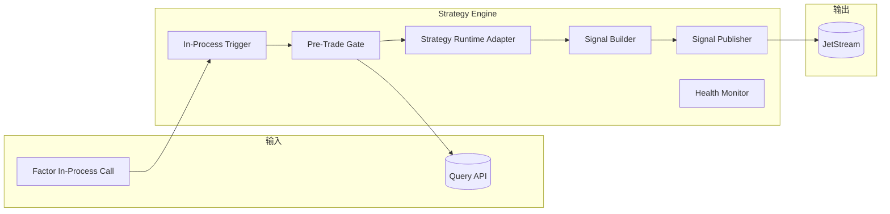
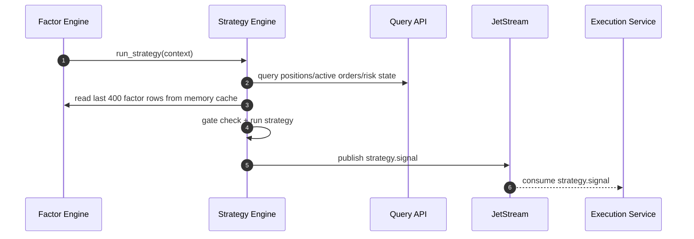

# 决策服务技术设计（Strategy Engine）

## 1. 文档目标

定义 `vnpy_hft` 策略模块的可实现技术方案，覆盖：

- 通过进程内接口接收因子模块回调
- 直接复用因子模块维护的最近 `400` 行因子缓存
- 接入 `ArchetypeTrader` 决策逻辑
- 执行前置闸门校验并输出交易信号
- 支撑按 `product_id` 的同进程部署、状态恢复与信号时效控制
- 策略触发节奏完全跟随因子模块的 `factor_time_interval`

本设计中的策略模块是 `Decision Pipeline` 的一部分，和因子模块同进程部署。

## 2. 职责边界

### 2.1 策略模块只负责

- 接收因子模块的进程内回调
- 管理策略运行上下文：持仓、活动委托状态、行情新鲜度、风控放行状态
- 读取当前因子值和最近 `400` 行因子缓存
- 在满足闸门条件时运行策略逻辑
- 发布 `strategy.signal`

### 2.2 策略模块不负责

- 行情订阅与原始行情主事实落库
- 因子计算本身
- 因子归档写库
- 最终下单、撤单、成交处理
- 委托状态生命周期管理

### 2.3 相关模块职责

- 因子模块：计算因子、维护最近 `400` 行因子缓存，并通过内存直接调用策略模块
- 归档服务：消费 `factor.unit.calculated.*` 并写入 `factor_unit_*`
- 执行服务：消费 `strategy.signal` 并发单
- 风控服务：给出事前风控结论
- `vnpy` 执行底座：通过 `OmsEngine` 提供持仓、活动委托、成交等实时状态语义参考

## 3. 与 vn.py 的对接定位

`vnpy` 为策略模块提供的重要参考有三类：

- `EventEngine` 的事件驱动调度模型
- `OmsEngine` 的实时态缓存模型：活动委托、持仓、账户
- 策略模板中的目标状态管理思路

参考依据：

- `vnpy` 文档说明实盘策略主要从 `TickData` 推进计算，长周期数据仍由 tick 合成
- `portfolio_strategy` 文档展示了多合约策略在同一运行时中组织决策的思路
- `vnpy.alpha.strategy.template.AlphaStrategy` 展示了“当前仓位 + 目标仓位 + 执行调整”的抽象模式

因此，策略模块应吸收 `vnpy` 的状态管理方式，但在物理部署上与因子模块同进程运行，不直接依赖因子消息通道或 PostgreSQL 因子表。

## 4. 服务边界

### 4.1 输入

- In-Process：`FactorEngine.run_strategy(context)`
- 同步查询接口：当前持仓、活动委托、风控参数、最新账户状态

### 4.2 输出

- JetStream：`strategy.signal`

### 4.3 依赖

- `NATS JetStream`
- `OMS/Query API`
- `ArchetypeTrader` 中迁移后的在线策略推断模块

## 5. 逻辑架构



## 6. 模块设计

### 6.1 In-Process Trigger

职责：

- 接收因子模块传入的 `FactorDecisionContext`
- 读取当前因子值与最近 `400` 行因子缓存
- 作为策略计算的唯一触发入口

### 6.2 Pre-Trade Gate

职责：

- 校验活动委托是否已终态
- 校验持仓快照是否新鲜
- 校验因子上下文中的行情时间是否新鲜
- 校验风控是否通过

闸门规则：

- `no_active_orders`
- `position_fresh`
- `market_fresh`
- `risk_passed`

只有全部满足，才允许进入策略运行阶段。

### 6.3 Strategy Runtime Adapter

职责：

- 对接 `ArchetypeTrader` 中迁移后的在线推断逻辑
- 将当前因子、最近 `400` 行因子缓存、对应 `factor_time_interval` 的行情窗口、持仓状态组装为模型输入
- 输出目标信号或目标仓位

要求：

- 策略逻辑可版本化：`strategy_id` + `strategy_version`
- 运行失败不得破坏主循环，应写告警并丢弃本次周期

### 6.4 Signal Builder

职责：

- 生成统一信号对象
- 计算 `generated_at`、`expire_at`、`cycle_id`
- 将目标动作转换为执行层可理解的信号结构

### 6.5 Signal Publisher

职责：

- 发布 `strategy.signal`

要求：

- 信号必须包含时效控制字段
- 发布采用 at-least-once，下游执行层做幂等

## 7. 核心业务机制

### 7.1 触发机制

- 每次由因子模块完成一个 `factor_time_interval` 后立即触发一次策略计算
- 若同一周期已存在未终态委托，则直接跳过
- 策略模块不再单独消费 `md.tick.raw.<product_id>` 或 `factor.unit.calculated.<product_id>`

### 7.2 周期与幂等

- 每次策略运行分配唯一 `cycle_id`
- 相同 `instrument_id + factor_time_interval + unit_end_ts + strategy_id` 只允许产出一组有效信号
- 若因重试重复进入，需利用 `cycle_id` 做信号去重

### 7.3 信号时效

- 每个信号必须包含 `expire_at`
- 执行层收到信号后再次校验时效
- 过期信号直接丢弃并记录告警

### 7.4 持仓参与策略

- 输入中必须包含当前持仓
- 持仓状态需与活动委托联动检查，避免脏读
- 若持仓快照过旧，本轮决策必须跳过

## 8. 事件模型

### 8.1 `strategy.signal`

```json
{
  "event_id": "01J...",
  "event_type": "strategy.signal.v1",
  "cycle_id": "rb2610-20260426-093020-01",
  "strategy_id": "arch_trader_v1",
  "strategy_version": "v1",
  "product_id": "rb",
  "instrument_id": "rb2610",
  "trading_day": "2026-04-26",
  "factor_time_interval": "20s",
  "unit_end_ts": "2026-04-26T09:30:20+08:00",
  "generated_at": "2026-04-26T09:30:20.120+08:00",
  "expire_at": "2026-04-26T09:30:20.620+08:00",
  "signal_type": "target_position",
  "target_position": 2,
  "reason": "factor_score_positive_breakout"
}
```

## 9. 关键时序



## 10. 一致性与恢复

### 10.1 幂等

- 事件幂等键：`event_id`
- 决策幂等键：`strategy_id + instrument_id + factor_time_interval + unit_end_ts + cycle_id`

### 10.2 重启恢复

- 启动时绑定因子模块的内存缓存与回调接口
- 不直接从 PostgreSQL 读取因子历史，也不从 Redis 恢复因子缓存
- 恢复期不发布信号，直到因子模块的最近 `400` 行因子缓存装载完成

### 10.3 异常处理

- 因子上下文缺失：跳过本轮决策并告警
- 持仓状态过旧：跳过本轮决策
- 策略推理失败：记录错误并丢弃本轮周期

## 11. 部署规范

### 11.1 默认部署

- 默认推荐：`1 decision-pipeline shard -> 1 product_id`
- 策略模块与因子模块同进程部署，通过内存接口接收触发
- 与行情服务分片保持一致
- 强制约束：单个决策流水线实例只允许绑定一个 `product_id`

### 11.2 单品种多合约

- 单实例处理同一 `product_id` 下的前4主力合约
- 每个 `instrument_id` 独立生成策略周期，但共享同一进程内因子缓存机制
- 适合作为生产默认方案

### 11.3 禁止多品种混部

- 本系统不允许单个决策流水线实例同时处理多个 `product_id`
- 若同时交易 `AL`、`FU`，则必须分别启动 `decision-pipeline-AL` 与 `decision-pipeline-FU`
- 这样可保证信号节奏、因子缓存、风控查询和周期闸门都保持单品种内聚

## 12. 配置项

- `factor_time_interval`
- `strategy_trigger_mode=inprocess`
- `signal_ttl_ms`
- `market_freshness_threshold_ms`
- `position_freshness_threshold_ms`
- `strategy_query_api_endpoint`
- `strategy_id`
- `strategy_version`
- `max_cycle_retry`

## 13. 可观测性与告警

### 13.1 指标

- `strategy_cycle_qps`
- `strategy_inproc_trigger_latency_ms_p95/p99`
- `strategy_gate_reject_rate`
- `strategy_inference_latency_ms_p95/p99`
- `strategy_signal_publish_fail_rate`
- `strategy_signal_expired_before_execution`

### 13.2 告警

- `Warning`：闸门拒绝率异常升高、推理延迟升高
- `Critical`：连续信号发布失败、周期停滞、状态恢复失败

## 14. 测试与验收

### 14.1 单元测试

- 因子模块回调与最近 `400` 行因子缓存读取逻辑
- 闸门规则正确性
- 信号时效字段生成正确性

### 14.2 集成测试

- 接收因子模块回调并生成 `strategy.signal`
- 无活动委托/有活动委托两类周期行为验证
- 风控阻断与持仓过旧场景验证

### 14.3 验收门槛

- 因子回调到信号发布 `p99 <= 500ms`
- 过期信号零误下发
- 周期幂等与委托闸门行为符合设计

## 15. 实施计划（建议）

1. 第一阶段：回调与闸门
- 完成因子模块回调接入以及闸门骨架

2. 第二阶段：策略迁移
- 接入 `ArchetypeTrader` 在线推断模块，完成信号输出

3. 第三阶段：联调与恢复
- 完成与执行服务、风控服务联调，以及恢复/告警闭环

## 16. 关联文档

- `vnpy_hft/docs/requirements/01_architecture_design.md`
- `vnpy_hft/docs/requirements/02_database_table_design.md`
- `vnpy_hft/docs/requirements/03_technical_architecture_diagram.md`
- `vnpy_hft/docs/design/01_market_data_service_technical_design.md`
- `vnpy_hft/docs/design/02_factor_engine_technical_design.md`
- `vnpy/docs/community/info/architecture.md`
- `vnpy/docs/community/app/portfolio_strategy.md`
- `vnpy/vnpy/alpha/strategy/template.py`
