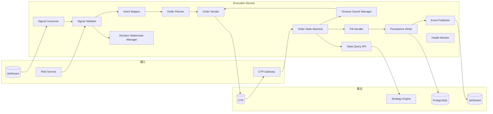
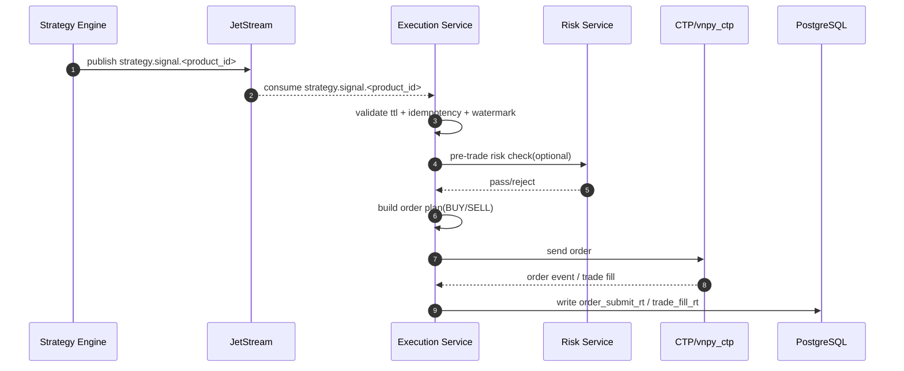
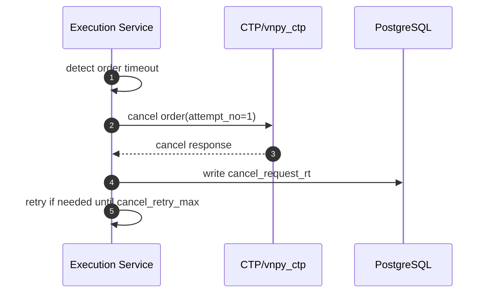

# 执行交易服务技术设计（Execution Service / OMS）

## 1. 文档目标

定义 `vnpy_hft` 执行交易服务的可实现技术方案，覆盖：

- 消费 `strategy.signal.<product_id>` 策略信号
- 校验信号时效与幂等后生成下单/撤单动作
- 通过 `vnpy_ctp` 发单并管理委托生命周期
- 处理成交回报、超时撤单与重试
- 维护“活动委托 + 持仓 + 决策水位”运行状态
- 当前版本仅支持“全买/全卖”执行语义，不做算法拆单
- 写入执行主事实表：`order_submit_*`、`cancel_request_*`、`trade_fill_*`
- 对外提供状态查询接口给策略服务使用

本服务是“信号到交易动作”的执行层，不承担因子计算与策略推理。

## 2. 职责边界

### 2.1 执行服务只负责

- 订阅并消费 `strategy.signal.<product_id>`
- 校验 `expire_at`、`cycle_id`、`decision_batch_no` 等关键字段
- 将 `BUY/SELL` 信号转换为“全仓目标”委托计划
- 执行下单、撤单、超时控制与撤单重试
- 处理委托回报、成交回报并更新状态
- 维护活动委托状态机和持仓快照
- 将执行事实写入 PostgreSQL
- 发布执行事件（可选）供监控与审计消费
- 提供查询接口（持仓、活动委托、状态水位）给策略服务

### 2.2 执行服务不负责

- 行情接入与行情缓存
- 因子计算与策略决策
- 因子/行情归档写库
- 日终结算与次交易日订阅规划

### 2.3 相关服务职责

- 策略服务：发布 `strategy.signal.<product_id>`
- 风控服务：提供事前校验结果（或同步风控查询）
- 归档服务：消费执行事件（可选）做审计级归档
- `vnpy` 底座：`MainEngine` + `OmsEngine` + `CtpGateway` 提供交易执行与回报语义

## 3. 与 vn.py 的对接定位

执行服务基于 `vnpy` 交易链路实现：

- `MainEngine.send_order()` / 网关下单
- `MainEngine.cancel_order()` / 网关撤单
- `OmsEngine` 缓存活动委托、成交与持仓状态
- 事件引擎回调委托/成交事件，驱动本服务状态机

说明：

- `vnpy` 提供交易执行与状态缓存能力
- 本服务补齐“信号语义 -> 订单语义”、时效控制、幂等、超时撤单、持久化与查询接口

关于“是否保证一定成交”的结论：

- `vnpy` 的 `MainEngine.send_order()` 仅将委托请求转发给网关，不保证一定成交。
- `OmsEngine` 通过 `EVENT_ORDER/EVENT_TRADE` 被动维护委托/成交状态，不主动撮合成交。
- 委托若长期未成交，会持续停留在活动状态（`SUBMITTING/NOTTRADED/PARTTRADED`）直到收到成交、撤销或拒单回报。
- 因此“保证成交”必须由执行策略实现（超时撤单、改价重发、风控降级等），不是 `vnpy` 内核默认保证。

## 4. 服务边界

### 4.1 输入

- JetStream：`strategy.signal.<product_id>`
- 同步输入：风控查询接口（可选）
- 网关输入：委托回报与成交回报（`vnpy_ctp`）

### 4.2 输出

- 交易网关：下单/撤单请求
- PostgreSQL：`order_submit_rt`、`cancel_request_rt`、`trade_fill_rt`
- JetStream（可选）：`order.submit.<product_id>`、`order.cancel.<product_id>`、`order.event.<product_id>`、`trade.fill.<product_id>`
- 查询接口：`position/active_orders/execution_watermark`

### 4.3 依赖

- `NATS JetStream`
- `vnpy_ctp`
- `PostgreSQL`
- 风控查询接口（可选）

## 5. 逻辑架构



## 6. 模块设计

### 6.1 Signal Consumer

职责：

- 订阅 `strategy.signal.<product_id>`
- 按 `product_id` 分片消费并维护 offset
- 将消息推送到校验模块

要求：

- 消费语义：at-least-once
- 同一 `product_id` 信号按到达顺序处理
- 同一 `instrument_id` 串行化执行，避免状态竞态

### 6.2 Signal Validator

职责：

- 校验字段完整性：`event_id`、`cycle_id`、`decision_batch_no`、`expire_at`、`signal_action`
- 校验时效：`now <= expire_at`
- 校验动作枚举：`BUY/SELL`
- 校验水位：丢弃落后于已执行批次的旧信号

规则：

- 过期信号直接丢弃并记录告警
- `decision_batch_no` 小于本地已应用水位时，判定为重复或过期批次
- `event_id` 重复时幂等跳过

### 6.3 Intent Mapper

职责：

- 将策略动作映射为执行意图
- 输入：`signal_action + 当前持仓 + 风控限制`
- 输出：目标方向与目标仓位（全仓）

映射规则（默认）：

- `BUY`：目标仓位 = `+max_position_by_product[product_id]`
- `SELL`：目标仓位 = `-max_position_by_product[product_id]`

说明：

- 当前版本只处理全仓切换信号，不处理部分调仓信号

### 6.4 Order Planner

职责：

- 根据执行意图和当前仓位生成订单计划
- 计算委托参数：`direction`、`offset`、`price`、`volume`、`tif`

规则：

- 若 `target_position == current_position`：直接完成本次周期，不下单
- 当前版本不做算法拆单（不做 TWAP/冰山/分批子单）
- 开平仓转换由 `vnpy` 的 `OffsetConverter` 处理，不作为策略层拆单能力
- 委托价格策略：基于最新盘口与滑点参数生成（如 `best_ask + slippage_ticks`）

### 6.5 Order Sender

职责：

- 调用 `vnpy` 下单/撤单接口
- 维护请求发送结果与回报关联键（`front_id/session_id/order_ref/order_sys_id`）

要求：

- 失败重试受控，避免重复发单
- 每次发单必须生成 `order_submit_rt` 记录

### 6.6 Order State Machine

职责：

- 维护委托状态生命周期：`submitted -> accepted/partial_filled/filled/canceled/rejected`
- 维护活动委托集合
- 更新每个 `instrument_id` 的执行状态

规则：

- 活动委托定义：未到终态（`filled/canceled/rejected`）的委托
- 同一 `cycle_id` 下重复信号不得导致重复新委托
- 委托状态变化应写入执行事件日志（可选发布 `order.event.<product_id>`）

### 6.7 Timeout Cancel Manager

职责：

- 监控活动委托是否超过 `timeout_ms`
- 触发撤单并记录撤单尝试次数
- 控制撤单重试策略与退避

规则：

- 撤单尝试逐次写入 `cancel_request_rt`（`attempt_no` 递增）
- 达到 `cancel_retry_max` 后升级 `system.alert`
- 若撤单请求长时间无回报，标记 `cancel_pending_timeout` 并阻断该 `instrument_id` 新开仓信号
- 进入人工/运维处置前，执行周期性状态对账（网关活动单 vs 本地活动单 vs 数据库状态）

### 6.8 Fill Handler

职责：

- 处理成交回报
- 更新持仓快照、平均持仓价格与资金状态
- 记录 `trade_fill_rt`

要求：

- 成交去重键：`account_id + trade_id`
- 部分成交与多笔成交均按事实逐笔落库

### 6.9 Decision Watermark Manager

定义：

- 决策水位（Decision Watermark）是执行服务对策略信号“已处理进度”的 checkpoint。
- 决策水位由 `last_decision_batch_no`（最后已生效批次号）与 `last_decision_ts`（最后已生效决策时间）组成。
- 用途：防止旧信号重复执行、处理乱序信号，并用于与 `OmsEngine` 状态对齐校验。

职责：

- 维护已应用决策水位：`last_decision_ts`、`last_decision_batch_no`
- 与 `OmsEngine` 状态水位做对齐检查
- 发现水位冲突时触发状态修复流程（占位）

规则：

- 只允许单调前进，不允许批次回退
- 水位冲突期间暂停接收新信号执行
- 新信号 `decision_batch_no` 小于当前水位时按旧批次处理（丢弃并记录幂等日志）

### 6.10 State Query API

职责：

- 对策略服务提供当前持仓快照查询
- 对策略服务提供当前活动委托快照查询
- 对策略服务提供执行状态水位（批次号/时间戳）查询

要求：

- 查询结果需带版本与时间戳字段，供上游做新鲜度判断

### 6.11 Persistence Writer

职责：

- 写入 `order_submit_rt` / `order_submit_his`
- 写入 `cancel_request_rt` / `cancel_request_his`
- 写入 `trade_fill_rt` / `trade_fill_his`

字段口径：

- 与 `docs/requirements/02_database_table_design.md` 的 4.4/4.5/4.6 保持一致

### 6.12 Event Publisher（可选）

职责：

- 发布 `order.submit.<product_id>`
- 发布 `order.cancel.<product_id>`
- 发布 `order.event.<product_id>`
- 发布 `trade.fill.<product_id>`

说明：

- 若部署选择“仅数据库主事实”，本模块可降级为关闭

## 7. 事件模型

### 7.1 输入主题：`strategy.signal.<product_id>`

执行服务按以下关键字段消费（完整定义见策略文档）：

```json
{
  "event_id": "01J...",
  "event_type": "strategy.signal.v1",
  "cycle_id": "rb2610-20260426-093020-01",
  "decision_batch_no": 1024,
  "decision_ts": "2026-04-26T09:30:20.110+08:00",
  "product_id": "rb",
  "instrument_id": "rb2610",
  "generated_at": "2026-04-26T09:30:20.120+08:00",
  "expire_at": "2026-04-26T09:30:20.620+08:00",
  "signal_action": "BUY"
}
```

### 7.2 `order.submit.<product_id>`（可选发布）

```json
{
  "event_id": "01J...",
  "event_type": "order.submit.v1",
  "product_id": "rb",
  "account_id": "sim_ctp_001",
  "cycle_id": "rb2610-20260426-093020-01",
  "instrument_id": "rb2610",
  "direction": "BUY",
  "offset": "OPEN",
  "price": 3512.0,
  "volume": 2,
  "timeout_ms": 3000,
  "submit_ts": "2026-04-26T09:30:20.180+08:00",
  "order_ref": "00012345"
}
```

### 7.3 `order.cancel.<product_id>`（可选发布）

```json
{
  "event_id": "01J...",
  "event_type": "order.cancel.v1",
  "product_id": "rb",
  "account_id": "sim_ctp_001",
  "order_ref": "00012345",
  "order_sys_id": "A001234567",
  "attempt_no": 1,
  "cancel_reason": "timeout",
  "request_ts": "2026-04-26T09:30:23.200+08:00"
}
```

### 7.4 `trade.fill.<product_id>`（可选发布）

```json
{
  "event_id": "01J...",
  "event_type": "trade.fill.v1",
  "product_id": "rb",
  "account_id": "sim_ctp_001",
  "instrument_id": "rb2610",
  "trade_id": "T202604260001",
  "order_ref": "00012345",
  "direction": "BUY",
  "offset": "OPEN",
  "price": 3512.0,
  "volume": 2,
  "trade_ts": "2026-04-26T09:30:20.260+08:00",
  "rev_ts": "2026-04-26T09:30:20.300+08:00"
}
```

## 8. 关键时序

### 8.1 正常执行链路



### 8.2 超时撤单链路



## 9. 一致性与恢复

### 9.1 幂等键

- 信号幂等键：`event_id`
- 决策幂等键：`product_id + instrument_id + cycle_id + decision_batch_no`
- 委托幂等键：`account_id + front_id + session_id + order_ref`
- 成交幂等键：`account_id + trade_id`

### 9.2 重启恢复

- 启动后先从网关与本地状态恢复活动委托
- 从数据库恢复最近执行水位（`last_decision_ts`、`last_decision_batch_no`）
- 恢复完成前暂停新信号执行
- 恢复后继续消费 `strategy.signal.*`

### 9.3 状态对账（占位）

- 周期性对账：`OmsEngine` 状态 vs 数据库状态
- 检测项：活动委托集合、持仓数量、最近批次水位
- 发现不一致时触发修复流程并告警

## 10. 部署规范

### 10.1 默认部署

- 推荐：`1 execution-shard -> 1 account_id`
- 单实例可处理多个 `product_id`，但按 `instrument_id` 串行执行
- 与策略服务分离部署，避免计算抖动影响下单时延

### 10.2 高可用建议

- 主备切换采用单活消费者组，避免重复发单
- 关键状态（水位、活动委托）定期持久化

### 10.3 与决策服务的关系

- 决策服务按 `product_id` 分片部署
- 执行服务按账户聚合执行，负责跨品种统一委托状态与持仓视图

## 11. 配置项

| 配置项 | 默认值/示例 | 含义 | 备注 |
| --- | --- | --- | --- |
| `execution_signal_subject_pattern` | `strategy.signal.{product_id}` | 信号订阅主题模板 | 消费策略信号 |
| `execution_order_submit_subject_pattern` | `order.submit.{product_id}` | 下单事件主题模板 | 可选发布 |
| `execution_order_cancel_subject_pattern` | `order.cancel.{product_id}` | 撤单事件主题模板 | 可选发布 |
| `execution_order_event_subject_pattern` | `order.event.{product_id}` | 委托状态事件主题模板 | 可选发布 |
| `execution_trade_fill_subject_pattern` | `trade.fill.{product_id}` | 成交事件主题模板 | 可选发布 |
| `account_id` | `sim_ctp_001` | 执行账户标识 | 分片主键 |
| `gateway_name` | `CTP` | 网关名称 | 对应 `vnpy_ctp` |
| `order_timeout_ms` | `3000` | 委托超时阈值 | 到时触发撤单 |
| `cancel_retry_max` | `3` | 最大撤单重试次数 | 超过则告警 |
| `cancel_retry_backoff_ms` | `200` | 撤单重试退避时间 | - |
| `signal_ttl_strict` | `true` | 是否严格丢弃过期信号 | 建议开启 |
| `risk_precheck_enabled` | `true` | 是否启用执行前风控校验 | 作为最后一道闸门 |
| `max_position_by_product` | `{"rb":2,"al":2}` | 各品种最大仓位 | 参与订单计划 |
| `price_mode` | `best_opponent` | 下单价格模式 | `best_opponent/slippage_tick` |
| `slippage_ticks` | `1` | 价格偏移档位 | `slippage_tick` 模式生效 |
| `execution_state_reconcile_interval_ms` | `5000` | 状态对账周期 | - |
| `execution_query_api_bind` | `0.0.0.0:18081` | 查询接口监听地址 | 给策略服务查询 |

说明：

- 历史主题 `order.submit/order.cancel/order.event/trade.fill` 可作为兼容别名，推荐逐步切换到按 `product_id` 分片主题。

## 12. 可观测性与告警

### 12.1 指标

- `execution_signal_consume_qps`
- `execution_signal_stale_drop_total`
- `execution_signal_idempotent_drop_total`
- `execution_submit_latency_ms_p95/p99`
- `execution_order_reject_total`
- `execution_timeout_cancel_total`
- `execution_cancel_retry_total`
- `execution_trade_fill_latency_ms_p95/p99`
- `execution_active_order_count`
- `execution_state_reconcile_mismatch_total`

### 12.2 告警

- `Warning`：撤单重试升高、成交回报延迟升高、状态对账差异出现
- `Critical`：连续下单失败、活动委托长期无法终态、状态对账持续不一致

## 13. 测试与验收

### 13.1 单元测试

- 信号时效与幂等判定
- `BUY/SELL` 到全仓目标计划映射
- 无算法拆单约束下的单信号单计划生成逻辑
- 超时撤单与重试策略
- 决策水位单调性校验

### 13.2 集成测试

- 消费 `strategy.signal.<product_id>` 并完成下单
- 委托回报、成交回报、部分成交场景
- 超时撤单与多次撤单落库
- 状态查询接口返回持仓/活动委托/水位正确

### 13.3 验收门槛

- 信号到发单 `p99 <= 50ms`（不含交易所回报时延）
- 过期信号零误下发
- 成交与落库记录一致率 `100%`
- 重启恢复后无重复发单、无批次回退

## 14. 实施计划（建议）

1. 第一阶段：信号消费与基础发单
- 完成 `strategy.signal.<product_id>` 消费、校验、发单闭环

2. 第二阶段：状态机与超时撤单
- 完成活动委托状态机、超时撤单和撤单重试

3. 第三阶段：持久化与查询接口
- 完成 `order_submit/cancel_request/trade_fill` 落库和查询 API

4. 第四阶段：对账与告警
- 完成水位对账、异常修复占位、监控告警闭环

## 15. 关联文档

- `vnpy_hft/docs/requirements/01_architecture_design.md`
- `vnpy_hft/docs/requirements/02_database_table_design.md`
- `vnpy_hft/docs/requirements/03_technical_architecture_diagram.md`
- `vnpy_hft/docs/design/03_strategy_engine_technical_design.md`
- `vnpy/docs/community/info/architecture.md`
