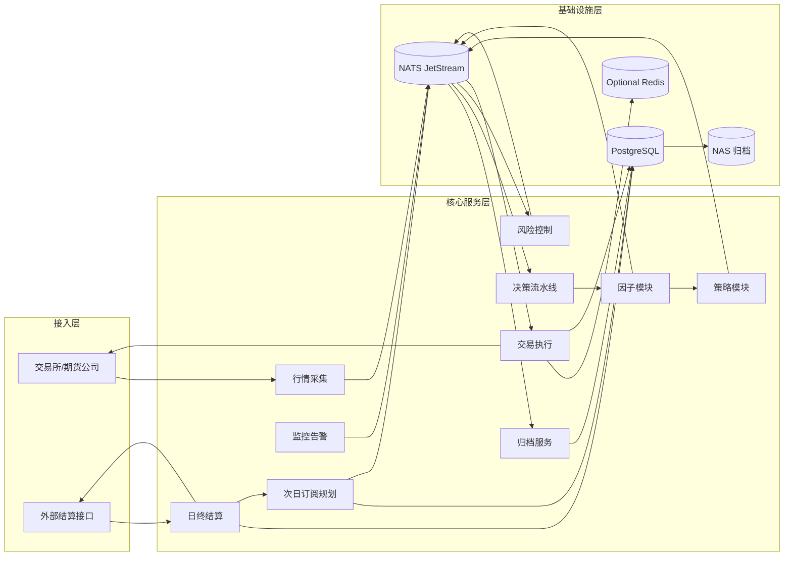
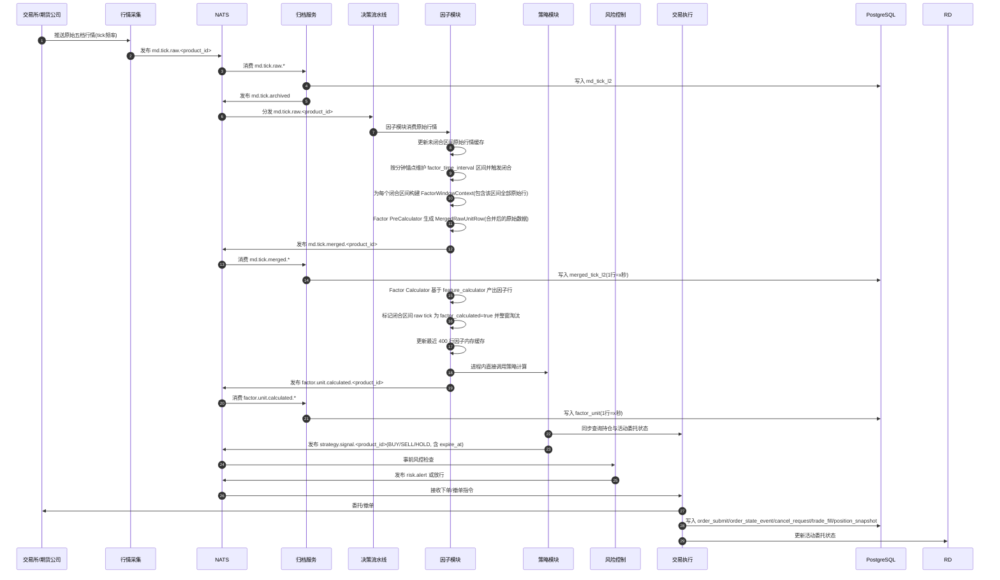
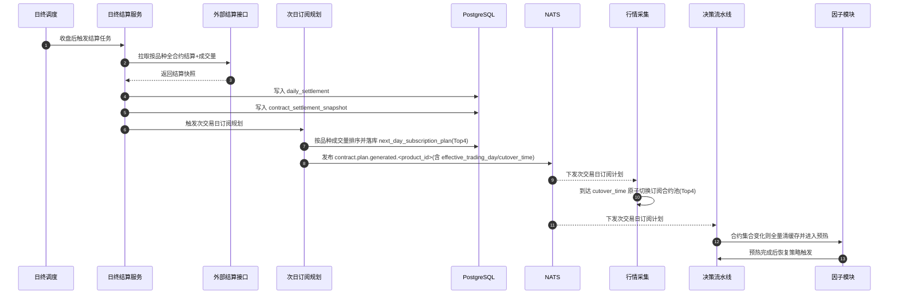

# 技术架构图（独立版）

本版以“先总览、再时序”为主，优先可读性。

## 项目来源说明（四项目整合）

- `vnpy_hft` 为统一集成项目，承接其余 3 个项目能力
- `vnpy` 提供交易系统底座（`vnpy_ctp` 接入、事件驱动、执行链路）
- `MacroHFT_Features_SH` 提供因子工程能力（训练数据口径与实时特征计算逻辑）
- `ArchetypeTrader` 提供策略研究与决策能力（信号生成与策略判定逻辑）

## 图 1：系统总览（分层）

## 图 2：日内主链路（时序）

## 图 3：日终结算与次交易日订阅（时序）

## 说明

- 因子口径：`1` 行因子 = `1` 个 `factor_time_interval` 区间结果。
- 术语口径：`product_id` 是品种（如 `rb`），`instrument_id` 是具体合约（如 `rb2610`），`vt_symbol=instrument_id.exchange`。
- 解析规则：`product_id` 由 `instrument_id` 去掉末尾数字得到（如 `rb2610 -> rb`、`IF2606 -> IF`）。
- 内存窗口：运行期原始行情缓存仅保留未闭合区间；`raw_market_cache_seconds=300` 用于重启回看 + 最近 `400` 行因子缓存。
- 区间规则：`factor_time_interval_seconds` 需整除 `60`，按分钟锚点闭合（如 `20s -> 00/20/40/60`）。
- 上下文规则：`FactorWindowContext` 必须包含对应区间的全部原始数据行。
- 两阶段计算：先由 `Factor PreCalculator` 生成 `MergedRawUnitRow`，再由 `Factor Calculator` 计算最终因子行。
- 合并行归档：`MergedRawUnitRow` 需要发布到 `md.tick.merged.<product_id>` 并由归档服务写入 `merged_tick_l2_*`。
- 口径对齐：PreCalculator 对齐 `step4_preprocess_order_files_v2.py` 的 `interval_to_seconds()` 与 `aggregate_by_minute()`。
- 因子口径：`feature_calculator.py` 的 `calculate_all_features()` 为计算基准，`get_feature_columns()` 为因子列校验基准。
- 因子配置：按 `product_id` 配置因子列表，输出列必须是 `get_feature_columns()` 子集。
- 缓存来源：重启时因子模块从 PostgreSQL 加载两类缓存；非重启时原始行情缓存由消费 topic 流实时构建，因子缓存由在线计算结果持续滚动保留。
- 淘汰规则：闭合区间计算完成后整窗淘汰，未计算数据不得淘汰。
- 合约切换：若 `product_id` 合约集合变化，因子模块全量清空缓存并预热；预热阈值按 `factor_cache_rows` 达标后恢复策略触发。
- 行情采集职责：只接收并发布 `md.tick.raw.<product_id>`，不直接落库。
- 行情采集轻量化：不做标准化、窗口聚合和数据库写入。
- 归档职责：独立消费 `md.tick.raw.*`、`md.tick.merged.*` 与 `factor.unit.calculated.*` 并写入 PostgreSQL。
- 决策信号归档：归档服务消费 `strategy.signal.<product_id>` 并写入 `strategy_signal_*`。
- 执行写库职责：执行服务直接写入 `order_submit_*`、`order_state_event_*`、`cancel_request_*`、`trade_fill_*`、`position_snapshot_*`。
- `HOLD` 信号也会发布到 `strategy.signal.<product_id>`；执行服务按 no-op 处理，数据库落库后续扩展。
- 时间区间闭合：由因子模块维护；策略模块通过进程内调用直接复用闭合结果。
- 分片扩展：决策流水线必须按 `product_id` 分配实例，不同品种不得在同一计算实例内混跑。
- 部署示例：`AL` 启动 `decision-pipeline-AL`，`FU` 启动 `decision-pipeline-FU`，分别订阅 `md.tick.raw.AL`、`md.tick.raw.FU`。
- 次日切换：行情采集服务依据订阅计划在 `effective_trading_day` 的 `cutover_time` 切换合约。
- 默认订阅规则：次交易日每个品种选当日成交量前4主力合约。
