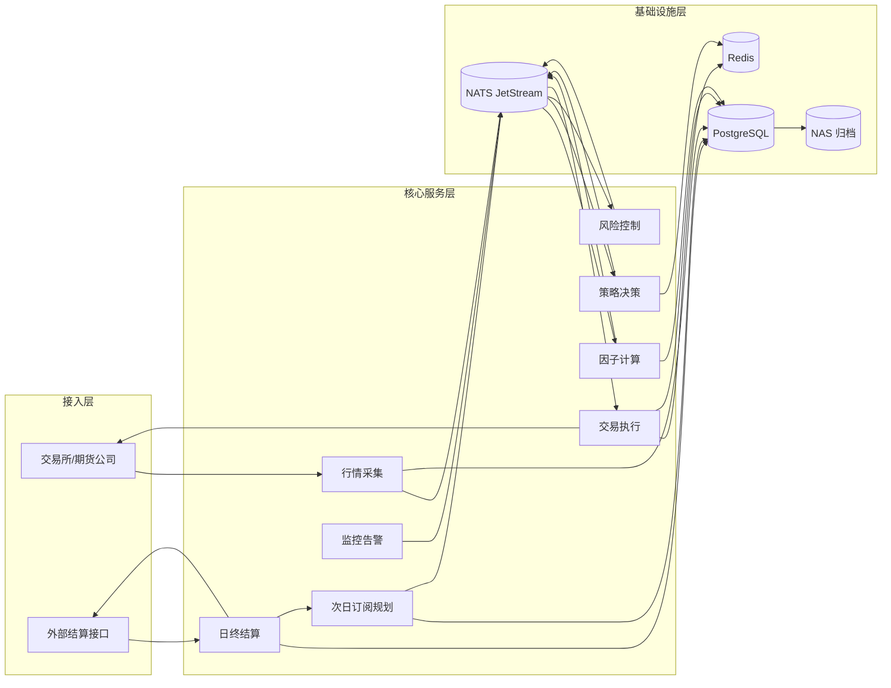
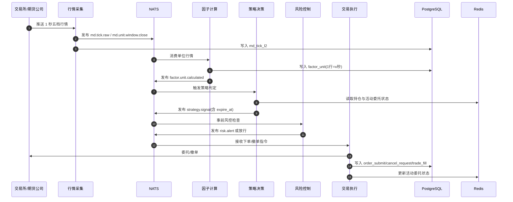
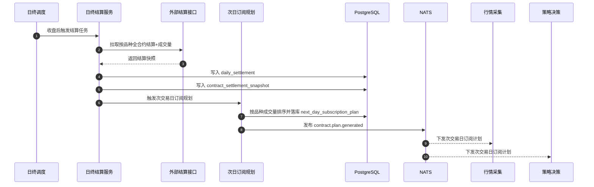

# 技术架构图（独立版）

本版以“先总览、再时序”为主，优先可读性。

## 项目来源说明（四项目整合）

- `vnpy_hft` 为统一集成项目，承接其余 3 个项目能力
- `vnpy` 提供交易系统底座（`vnpy_ctp` 接入、事件驱动、执行链路）
- `MacroHFT_Features_SH` 提供因子工程能力（训练数据口径与实时特征计算逻辑）
- `ArchetypeTrader` 提供策略研究与决策能力（信号生成与策略判定逻辑）

## 图 1：系统总览（分层）

## 图 2：日内主链路（时序）

## 图 3：日终结算与次交易日订阅（时序）

## 说明

- 因子口径：`1` 行因子 = `x(unit_seconds)` 秒行情结果。
- 内存窗口：固定 `400` 秒五档行情 + 对应 `ceil(400/x)` 行因子。
- 默认订阅规则：次交易日每个品种选当日成交量最高合约。
